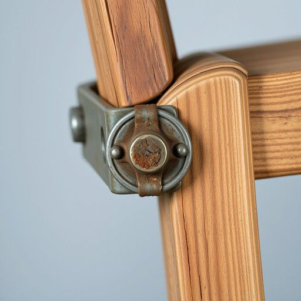

# rivet

<h1 style="font-size: 2.5em; font-weight: 300; letter-spacing: 2px; margin: 0; color: #2c3e50;">
/ˈrɪvət/
</h1>

---

---

## 例句

When we were repairing the old wooden chair in the living room, I noticed that one of the rivets holding the metal bracket in place had rusted through, which not only compromised the stability of the frame but also made me realise how crucial it is to replace such small yet essential components promptly to ensure the furniture remains safe and durable over time.

*When(/wɪn/) we(/wi/) were(/wər/) repairing(/rɪˈpɛrɪŋ/) the(/ðə/) old(/oʊld/) wooden(/ˈwʊdən/) chair(/ʧɛr/) in(/ɪn/) the(/ðə/) living(/ˈlɪvɪŋ/) room,(/rum,/) I(/aɪ/) noticed(/ˈnoʊtɪst/) that(/ðət/) one(/wən/) of(/əv/) the(/ðə/) rivets(/ˈrɪvəts/) holding(/ˈhoʊldɪŋ/) the(/ðə/) metal(/ˈmɛtəl/) bracket(/ˈbrækɪt/) in(/ɪn/) place(/pleɪs/) had(/hæd/) rusted(/ˈrəstɪd/) through,(/θru,/) which(/wɪʧ/) not(/nɑt/) only(/ˈoʊnli/) compromised(/ˈkɑmprəˌmaɪzd/) the(/ðə/) stability(/stəˈbɪlɪti/) of(/əv/) the(/ðə/) frame(/freɪm/) but(/bət/) also(/ˈɔlsoʊ/) made(/meɪd/) me(/mi/) realise(/ˈriəˌlaɪz/) how(/haʊ/) crucial(/ˈkruʃəl/) it(/ɪt/) is(/ɪz/) to(/tɪ/) replace(/ˌriˈpleɪs/) such(/səʧ/) small(/smɔl/) yet(/jɛt/) essential(/ɛˈsɛnʃəl/) components(/kəmˈpoʊnənts/) promptly(/ˈprɑmptli/) to(/tɪ/) ensure(/ɪnˈʃʊr/) the(/ðə/) furniture(/ˈfərnɪʧər/) remains(/rɪˈmeɪnz/) safe(/seɪf/) and(/ənd/) durable(/ˈdʊrəbəl/) over(/ˈoʊvər/) time.(/taɪm./)*

**翻译：** 当我们修理客厅里的旧木椅时，我注意到固定金属支架的一个铆钉已经生锈穿透，这不仅影响了框架的稳定性，也让我意识到及时更换这些虽然微小但至关重要的部件，是确保家具长期安全耐用的关键。

---

## 解释

英语单词“rivet”作为名词在家居生活用品场景中，通常指的是一种金属铆钉，用于固定家具部件或家用器具的结构连接处，确保稳固和耐用，如沙发框架的连接或金属家具的拼接。在具体使用中，rivet常出现在描述家具装配、五金配件或装修材料相关的语境中，常见搭配包括“steel rivet”（钢铆钉）、“blind rivet”（盲铆钉）等，使用时需要注意其不可数名词和可数名词的区分，单复数形式为rivet/rivets，且通常与动词“use”（使用）、“install”（安装）、“replace”（更换）等搭配。语法上，rivet作为具体物品名词，无特殊变化或复杂结构，适合初中及以上英语学习者掌握。此外，在表达技巧上，结合具体场景如家具结构时用“metal rivet to secure joints”（用金属铆钉固定连接处）更为贴切。词源方面，“rivet”源自中古英语“rivet”，其根源来自古法语“rivete”，意指用铁环或铆钉固定的物件，进一步追溯至拉丁语“rivus”，意为小溪或流动，可能暗示铆钉形成的环状连接像流水环绕。中文环境中，“rivet”一般准确翻译为“铆钉”，表示一种金属紧固件，侧重机械连接功能，无贬义或褒义，属于中性词汇，常见于工业、家居维修或装修技术领域，学习者应避免将其误解为装饰性零件，从而正确理解其结构性连接的实用价值。

---

<small style="color: #999; font-size: 0.9em;">2025-07-17 06:22:40</small>

