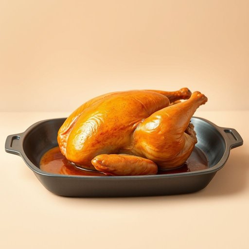

# roaster

<h1 style="font-size: 2.5em; font-weight: 300; letter-spacing: 2px; margin: 0; color: #2c3e50;">
/ˈroʊstər/
</h1>

---

---

## 例句

After the intricate plan was unveiled, the revelation of the secret, combined with the unwavering dedication of the team, transformed the project into a remarkable success that inspired innovation and collaboration across the entire industry.

*After(/ˈæftər/) the(/ðə/) intricate(/ˈɪntrəkət/) plan(/plæn/) was(/wɑz/) unveiled,(/ənˈveɪld,/) the(/ðə/) revelation(/ˌrɛvəˈleɪʃən/) of(/əv/) the(/ðə/) secret,(/ˈsikrɪt,/) combined(/kəmˈbaɪnd/) with(/wɪθ/) the(/ðə/) unwavering(/ənˈweɪvərɪŋ/) dedication(/ˌdɛdəˈkeɪʃən/) of(/əv/) the(/ðə/) team,(/tim,/) transformed(/trænsˈfɔrmd/) the(/ðə/) project(/ˈprɑʤɛkt/) into(/ˈɪntu/) a(/ə/) remarkable(/rɪˈmɑrkəbəl/) success(/səkˈsɛs/) that(/ðət/) inspired(/ˌɪnˈspaɪərd/) innovation(/ˌɪnəˈveɪʃən/) and(/ənd/) collaboration(/kəˌlæbərˈeɪʃən/) across(/əˈkrɔs/) the(/ðə/) entire(/ɪnˈtaɪər/) industry.(/ˈɪndəstri./)*

**翻译：** 在复杂计划揭晓后，秘密的揭示与团队坚定不移的奉献精神相结合，将该项目转变为一项非凡的成功，激发了整个行业的创新与协作。

---

## 解释

英语单词“roaster”在家居生活用品的语境中作为名词，通常指用于烤制食物的器具，尤其是指能够放入烤箱或炉灶中用来烘烤整只禽类（如鸡、火鸡）或肉块的大烤盘或烤锅。这类器具通常具有深边和耐高温的材质，方便盛放食物及其油汁，适合做焙烤和烤制。具体使用场合多见于家庭厨房、烹饪教程或餐饮环境中，如“a roasting pan”即“roaster”，可用于描述烤肉时所用的锅具。英语学习者在使用“roaster”时应注意它作为可数名词，其复数形式为“roasters”，且常与“oven”（烤箱）、“turkey”（火鸡）等词搭配，例如“a turkey roaster”表示专为烤火鸡设计的烤盘。此外，“roaster”也可指“烘焙机”或“咖啡烘焙机”，但在家居用品中更常指烤盘类用具。词源方面，“roaster”起源于动词“roast”（烤，烘焙）加上表示人的或物的后缀“-er”，意指“用来烤东西的器具”，历史可追溯至中世纪英语。中文语境中，“roaster”多被翻译为“烤盘”、“烤锅”或“烤肉盘”，强调其实用性，没有特定褒贬色彩，属于中性词汇。在使用过程中需根据具体物品和用途选择恰当译法，以便准确传达其厨房用具的功能和属性。

---

<small style="color: #999; font-size: 0.9em;">2025-07-17 06:22:40</small>

