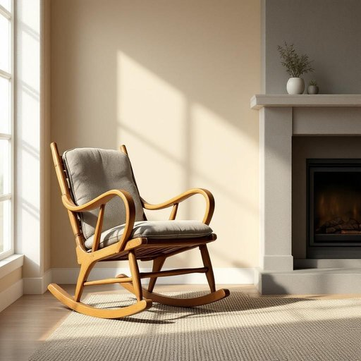

# rocker

<h1 style="font-size: 2.5em; font-weight: 300; letter-spacing: 2px; margin: 0; color: #2c3e50;">
/ˈrɑkər/
</h1>

---

---

## 例句

Whenever we redecorate the living room, my mother insists on keeping the old wooden rocker by the fireplace, which, despite its creaky joints and faded cushion, remains her favourite spot for reading and sipping tea during the chilly winter evenings.

*Whenever(/wɛˈnɛvər/) we(/wi/) redecorate(/riˈdɛkərˌeɪt/) the(/ðə/) living(/ˈlɪvɪŋ/) room,(/rum,/) my(/maɪ/) mother(/ˈməðər/) insists(/ˌɪnˈsɪsts/) on(/ɔn/) keeping(/ˈkipɪŋ/) the(/ðə/) old(/oʊld/) wooden(/ˈwʊdən/) rocker(/ˈrɑkər/) by(/baɪ/) the(/ðə/) fireplace,(/ˈfaɪərˌpleɪs,/) which,(/wɪʧ,/) despite(/dɪˈspaɪt/) its(/ɪts/) creaky(/ˈkriki/) joints(/ʤɔɪnts/) and(/ənd/) faded(/ˈfeɪdɪd/) cushion,(/ˈkʊʃən,/) remains(/rɪˈmeɪnz/) her(/hər/) favourite(/ˈfeɪvərɪt/) spot(/spɑt/) for(/fər/) reading(/ˈrɛdɪŋ/) and(/ənd/) sipping(/ˈsɪpɪŋ/) tea(/ti/) during(/ˈdʊrɪŋ/) the(/ðə/) chilly(/ˈʧɪli/) winter(/ˈwɪntər/) evenings.(/ˈivnɪŋz./)*

**翻译：** 每当我们重新布置客厅时，母亲总坚持要保留壁炉旁那把旧木摇椅，尽管它的接缝吱吱作响、坐垫也已褪色，却依然是她在寒冷冬夜中阅读和品茶的最爱之地。

---

## 解释

“rocker”作为名词在家居生活用品的语境中，主要指一种带有弧形底座的摇椅，使用场合通常是在家中供人休闲、放松时使用，例如客厅或阳台的摇椅。英语学习者在使用“rocker”时应注意它作为可数名词，可以用复数形式“rockers”，且常与名词“chair”搭配，如“a rocking chair”或简称“a rocker”。此外，“rocker”也可以用来形容具有摇动功能的某些家具或装置，但最常见含义是指摇椅。词源上，“rocker”来自动词“rock”（摇动），加上表示动作执行者的后缀“-er”，意为“摇动者”，最初用来指摇椅，强调其摇晃特性。在中文语境中，“rocker”准确翻译为“摇椅”，需注意避免直接音译成“摇克”或其他误译；该词通常无褒贬色彩，是一个中性词汇，但在某些文化背景下，摇椅因其舒适与传统印象，也带有温馨、怀旧的文化内涵。

---

<small style="color: #999; font-size: 0.9em;">2025-07-17 06:22:40</small>

