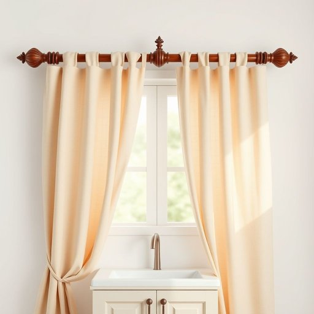

# rod

<h1 style="font-size: 2.5em; font-weight: 300; letter-spacing: 2px; margin: 0; color: #2c3e50;">
/rɑd/
</h1>

---

---

## 例句

Could you please hand me the curtain rod that’s stored in the cupboard above the sink, the one with the ornate finials at each end, so I can finally hang those new drapes we bought last weekend?

*Could(/kʊd/) you(/ju/) please(/pliz/) hand(/hænd/) me(/mi/) the(/ðə/) curtain(/ˈkərtən/) rod(/rɑd/) that’s(/that’s*/) stored(/stɔrd/) in(/ɪn/) the(/ðə/) cupboard(/ˈkəbərd/) above(/əˈbəv/) the(/ðə/) sink,(/sɪŋk,/) the(/ðə/) one(/wən/) with(/wɪθ/) the(/ðə/) ornate(/ɔrˈneɪt/) finials(/finials*/) at(/æt/) each(/iʧ/) end,(/ɛnd,/) so(/soʊ/) I(/aɪ/) can(/kən/) finally(/ˈfaɪnəli/) hang(/hæŋ/) those(/ðoʊz/) new(/nu/) drapes(/dreɪps/) we(/wi/) bought(/bɔt/) last(/læst/) weekend?(/ˈwiˌkɪnd?/)*

**翻译：** 请你把水槽上方橱柜里那根窗帘杆递给我，就是两端带有华丽装饰头的那根，好让我终于把上周末买的新窗帘挂起来。

---

## 解释

英语单词“rod”在家居生活用品的语境中作为名词，通常指细长且坚硬的棒状物，常见于窗帘杆、衣杆或晾衣杆等。具体使用场合包括安装窗帘时用来挂窗帘的杆子，衣柜中悬挂衣服用的衣杆，以及晾晒衣物时使用的晾衣杆等。英语学习者在使用“rod”时应注意其单复数形式“rods”，此外常见搭配有“curtain rod”（窗帘杆）、“clothes rod”（衣杆）、“shower rod”（浴帘杆）等，表达时多用定语修饰以明确其具体用途或位置。词源方面，“rod”源自古英语“rodd”，意指细长棒子，具有悠久的历史和普通用途，基本含义为细长硬杆，无明显褒贬色彩或特殊文化隐喻。在中文语境中，“rod”准确翻译为“杆”、“棒”或“杆子”，根据具体家居用品可译为“窗帘杆”、“衣杆”、“晾衣杆”等，强调其实用的支撑或悬挂功能。整体上，“rod”是一个中性词汇，广泛应用于家居装置中，理解时应结合具体物品环境，避免与具有特殊技术或机械含义的“rod”混淆。

---

<small style="color: #999; font-size: 0.9em;">2025-07-17 06:22:40</small>

