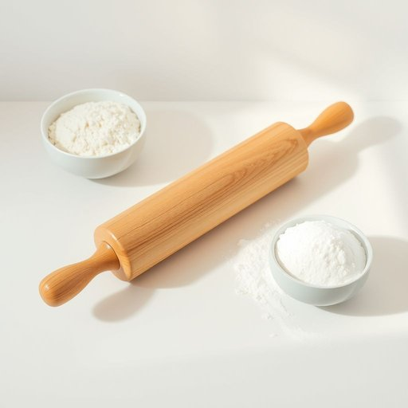

# rolling-pin

<h1 style="font-size: 2.5em; font-weight: 300; letter-spacing: 2px; margin: 0; color: #2c3e50;">
/rolling-pin*/
</h1>

---

---

## 例句

Before you start rolling out the dough for the pie, make sure the rolling-pin, which has been resting on the countertop next to the flour and sugar, is clean and dry to prevent the pastry from sticking or tearing during the preparation.

*Before(/ˌbiˈfɔr/) you(/ju/) start(/stɑrt/) rolling(/ˈroʊlɪŋ/) out(/aʊt/) the(/ðə/) dough(/doʊ/) for(/fər/) the(/ðə/) pie,(/paɪ,/) make(/meɪk/) sure(/ʃʊr/) the(/ðə/) rolling-pin,(/rolling-pin*,/) which(/wɪʧ/) has(/həz/) been(/bɪn/) resting(/ˈrɛstɪŋ/) on(/ɔn/) the(/ðə/) countertop(/ˈkaʊntərˌtɑp/) next(/nɛkst/) to(/tɪ/) the(/ðə/) flour(/flaʊər/) and(/ənd/) sugar,(/ˈʃʊgər,/) is(/ɪz/) clean(/klin/) and(/ənd/) dry(/draɪ/) to(/tɪ/) prevent(/prɪˈvɛnt/) the(/ðə/) pastry(/ˈpeɪstri/) from(/frəm/) sticking(/ˈstɪkɪŋ/) or(/ər/) tearing(/ˈtɪrɪŋ/) during(/ˈdʊrɪŋ/) the(/ðə/) preparation.(/ˌprɛpərˈeɪʃən./)*

**翻译：** 在开始擀制派皮之前，请确保一直放置在面粉和糖旁边的擀面杖干净且干燥，以防止面皮在制作过程中粘连或破损。

---

## 解释

英语单词'rolling-pin'作为名词，指的是厨房中用来擀面团的圆柱形工具，通常由木头、塑料或金属制成，使用时通过双手握住两端来滚动，使面团变薄均匀，常见于烘焙和制作各种面食的场合，如做饼干、披萨、包子皮等。在英语学习中，'rolling-pin'作为复合名词，通常连字符连接，使用时应注意单复数变化为'rolling-pins'，且在表达中常与动词‘use’，‘grab’，‘pick up’搭配，如'Grab a rolling-pin to roll out the dough.' 此外，‘rolling-pin’常与介词短语搭配，如‘with a rolling-pin’，表示使用这一工具的动作。该词源自于其功能性描述，roll指‘滚动’，pin指‘棍棒’，二者结合形象地说明其外形及功用，约在17世纪开始普及。中文语境中，‘rolling-pin’对应的准确翻译是“擀面杖”或“擀面棍”，是家居厨房中不可缺少的基础工具，理解时应重点抓住其在面食制作中的用途。此词没有特殊的褒贬色彩或文化内涵，仅属中性实用名词，反映了西方厨房用具的传统形态和功能，因此在交流或描述厨房用具时，使用该词能准确传递工具的物理属性和使用场景。

---

<small style="color: #999; font-size: 0.9em;">2025-07-17 06:22:40</small>

