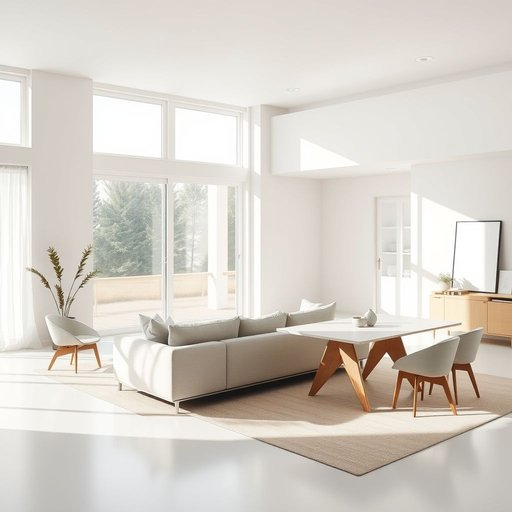

# room

<h1 style="font-size: 2.5em; font-weight: 300; letter-spacing: 2px; margin: 0; color: #2c3e50;">
/rum/
</h1>

---

---

## 例句

Although the living room, which is spacious enough to accommodate both a large sofa and a dining table, receives plenty of natural light during the day, the adjacent room, used as a storage space, is being converted into a home office to enhance productivity.

*Although(/ˌɔlˈðoʊ/) the(/ðə/) living(/ˈlɪvɪŋ/) room,(/rum,/) which(/wɪʧ/) is(/ɪz/) spacious(/ˈspeɪʃəs/) enough(/ɪˈnəf/) to(/tɪ/) accommodate(/əˈkɑməˌdeɪt/) both(/boʊθ/) a(/ə/) large(/lɑrʤ/) sofa(/ˈsoʊfə/) and(/ənd/) a(/ə/) dining(/ˈdaɪnɪŋ/) table,(/ˈteɪbəl,/) receives(/rɪˈsivz/) plenty(/ˈplɛnti/) of(/əv/) natural(/ˈnæʧərəl/) light(/laɪt/) during(/ˈdʊrɪŋ/) the(/ðə/) day,(/deɪ,/) the(/ðə/) adjacent(/əˈʤeɪsənt/) room,(/rum,/) used(/juzd/) as(/ɛz/) a(/ə/) storage(/ˈstɔrɪʤ/) space,(/speɪs,/) is(/ɪz/) being(/biɪŋ/) converted(/kənˈvərtɪd/) into(/ˈɪntu/) a(/ə/) home(/hoʊm/) office(/ˈɔfəs/) to(/tɪ/) enhance(/ɛnˈhæns/) productivity.(/ˌproʊdəkˈtɪvɪti./)*

**翻译：** 客厅宽敞，既能容纳大型沙发，也能放置餐桌，白天采光充足；毗邻的储藏室正被改造成家庭办公区，以提升工作效率。

---

## 解释

英语单词“room”在家居生活用品的语境中作为名词，主要指“房间”，即建筑物内部划分出来的独立空间，如卧室、客厅、厨房等，通常用于描述居住环境中的具体区域。具体使用场合包括谈论家里各个功能区、指引位置或描述空间大小，例如“There is a room for guests”（有一个客房）或“I need more room in my closet”（我需要衣柜里更多的空间）。 “room”作为名词时是可数名词，但也可用作不可数名词表示“空间、余地”，例如“There is no room for error”（没有犯错的余地）。学习者需注意“room”后常接介词短语表示用途或位置，如“in the room”、“a room for rent”，常见的搭配还有“bedroom”、“living room”、“dining room”，此外，“make room”表示“腾出空间”，是常用习语。词源方面，“room”源自古英语“rūm”，意为“空间、地点”，与德语“Raum”同源，体现出对空间的基本认知。中文语境中“room”通常对应“房间”，既指物理上的居住或使用空间，也含“余地、空间”之意，需结合具体语境翻译，如“房间”或“空间”。该词为中性词，无明显褒贬色彩，但在某些习语中可能表达含蓄的限制或自由，如“no room for doubt”表示“没有怀疑的余地”。总之，“room”是描述居住环境空间时不可或缺的基础词汇，理解其灵活用法和语法特征对学习英语日常生活用语尤为重要。

---

<small style="color: #999; font-size: 0.9em;">2025-07-17 06:22:40</small>

