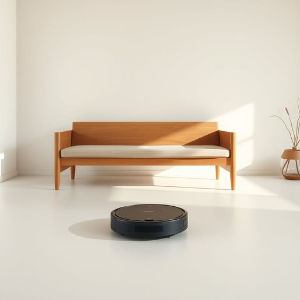

# roomba

<h1 style="font-size: 2.5em; font-weight: 300; letter-spacing: 2px; margin: 0; color: #2c3e50;">
/roomba*/
</h1>

---

---

## 例句

Although the living room was strewn with crumbs and pet hair after the kids’ birthday party, the Roomba, which we’d set to automatically clean every evening, whirred tirelessly around the furniture legs and under the sofa, ensuring that by morning the floor looked spotless without us having to lift a finger.

*Although(/ˌɔlˈðoʊ/) the(/ðə/) living(/ˈlɪvɪŋ/) room(/rum/) was(/wɑz/) strewn(/strun/) with(/wɪθ/) crumbs(/krəmz/) and(/ənd/) pet(/pɛt/) hair(/hɛr/) after(/ˈæftər/) the(/ðə/) kids’(/kids’*’/) birthday(/ˈbərθˌdeɪ/) party,(/ˈpɑrti,/) the(/ðə/) Roomba,(/roomba*,/) which(/wɪʧ/) we’d(/we’d*/) set(/sɛt/) to(/tɪ/) automatically(/ˌɔtəˈmætɪkli/) clean(/klin/) every(/ˈɛvəri/) evening,(/ˈivnɪŋ,/) whirred(/whirred*/) tirelessly(/ˈtaɪrləsli/) around(/əraʊnd/) the(/ðə/) furniture(/ˈfərnɪʧər/) legs(/lɛgz/) and(/ənd/) under(/ˈəndər/) the(/ðə/) sofa,(/ˈsoʊfə,/) ensuring(/ɪnˈʃʊrɪŋ/) that(/ðət/) by(/baɪ/) morning(/ˈmɔrnɪŋ/) the(/ðə/) floor(/flɔr/) looked(/lʊkt/) spotless(/ˈspɑtləs/) without(/wɪˈθaʊt/) us(/ˈjuˈɛs/) having(/ˈhævɪŋ/) to(/tɪ/) lift(/lɪft/) a(/ə/) finger.(/ˈfɪŋgər./)*

**翻译：** 尽管孩子们的生日派对后，客厅里布满了面包屑和宠物毛发，我们设定的Roomba扫地机器人每晚自动清扫，依旧不停地绕着家具腿和沙发底下忙碌，确保到了早晨，地板干净如新，我们甚至无需动一根手指。

---

## 解释

Roomba作为名词主要指由iRobot公司生产的一种自动化扫地机器人，常用于家庭生活中帮助自动清扫地面灰尘和碎屑，具体使用场合通常出现在描述现代家居清洁设备、智能家居产品或讨论提高生活便利性的语境中，例如“我用Roomba定时清扫客厅地板”，强调其自动化和便捷性。英语学习者在使用Roomba时需注意它是专有名词，通常作为单数名词使用，复数形式为Roombas，且一般不用于泛指所有扫地机器人，而专指这一品牌产品。常见搭配包括Roomba vacuum、Roomba robot vacuum cleaner、Roomba model等，表达时应注意其品牌属性及功能属性。词源上，Roomba是iRobot公司创造的商标名称，结合了room（房间）与类似rumba（一种舞蹈）的发音，寓意机器在房间内灵活移动并完成清扫任务。中文语境中，Roomba准确翻译为扫地机器人或扫地机，但因其品牌影响力，中文使用者往往直接音译为Roomba以指代该品牌产品，兼具品牌名和产品类称谓的双重含义。该词语无明显褒贬色彩，通常带有现代科技感和智能化家居的积极内涵，体现了高科技提升生活质量的理念。

---

<small style="color: #999; font-size: 0.9em;">2025-07-17 06:22:40</small>

