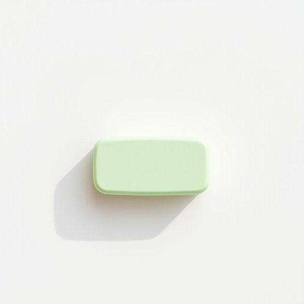

# rubber

<h1 style="font-size: 2.5em; font-weight: 300; letter-spacing: 2px; margin: 0; color: #2c3e50;">
/ˈrəbər/
</h1>

---

---

## 例句

Could you please pass me the rubber from the drawer, the one with the green casing that I usually use to erase pencil marks on important documents, since I need to correct these notes before the meeting starts?

*Could(/kʊd/) you(/ju/) please(/pliz/) pass(/pæs/) me(/mi/) the(/ðə/) rubber(/ˈrəbər/) from(/frəm/) the(/ðə/) drawer,(/drɔr,/) the(/ðə/) one(/wən/) with(/wɪθ/) the(/ðə/) green(/grin/) casing(/ˈkeɪsɪŋ/) that(/ðət/) I(/aɪ/) usually(/ˈjuʒəwəli/) use(/juz/) to(/tɪ/) erase(/ɪˈreɪs/) pencil(/ˈpɛnsəl/) marks(/mɑrks/) on(/ɔn/) important(/ˌɪmˈpɔrtənt/) documents,(/ˈdɑkjəmənts,/) since(/sɪns/) I(/aɪ/) need(/nid/) to(/tɪ/) correct(/kərˈɛkt/) these(/ðiz/) notes(/noʊts/) before(/ˌbiˈfɔr/) the(/ðə/) meeting(/ˈmitɪŋ/) starts?(/stɑrts?/)*

**翻译：** 请把抽屉里那块绿色外壳的橡皮递给我，就是我平常用来擦除重要文件上铅笔字迹的那块，因为我需要在会议开始前修改这些笔记。

---

## 解释

英语单词rubber在家居生活用品场景中作为名词，主要指由橡胶制成的物品，最常见的具体含义包括橡皮擦和橡胶制的密封件、垫圈等。使用场合通常是在谈论文具用品时指橡皮擦，如a rubber to erase pencil marks，或者在描述家居防滑垫、门窗密封条等橡胶部件时出现。英语学习者需要注意，rubber作为名词时既可以表示物质橡胶，也可以指代制成品，且在英式英语中rubber常用作橡皮擦的通称，而在美式英语中更常用eraser。在语法上，rubber是可数名词，如一块橡皮擦为a rubber，复数为rubbers，常见搭配包括rubber band（橡皮筋）、rubber mat（橡胶垫）等。词源上，rubber来源于17世纪末至18世纪，源自rub（擦）这个动词，因最初橡皮擦的主要功能是擦除铅笔痕迹而得名。中文语境中，rubber对应的翻译主要是橡胶物质或橡皮擦，取决于具体场景；需避免将其误解为美国英语中的避孕套含义，后者在英美口语中有时也称rubber，但这属于特殊且非正式用法，有一定的文化禁忌色彩。在正式或家居用品语境下，rubber通常中性且无褒贬含义，是描述材料和工具的中性词汇。

---

<small style="color: #999; font-size: 0.9em;">2025-07-17 06:22:40</small>

