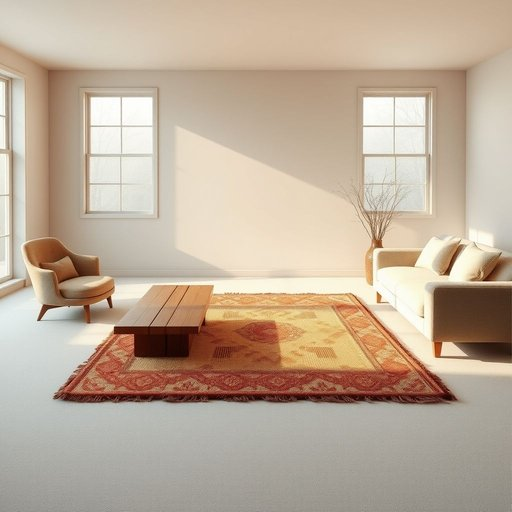

# rug

<h1 style="font-size: 2.5em; font-weight: 300; letter-spacing: 2px; margin: 0; color: #2c3e50;">
/rəg/
</h1>

---

---

## 例句

The afternoon's rearrangement of the living room involved the furniture's placement around a rug whose pattern intricacy and colour vibrancy complemented the coffee table's vintage oak and the armchairs' coziness, thus enhancing the space's visual cohesion and the warmth of winter evenings.

*The(/ðə/) afternoon's(/ˌæftərˈnunz/) rearrangement(/riərˈeɪnʤmənt/) of(/əv/) the(/ðə/) living(/ˈlɪvɪŋ/) room(/rum/) involved(/ˌɪnˈvɑlvd/) the(/ðə/) furniture's(/ˈfərnɪʧərz/) placement(/ˈpleɪsmənt/) around(/əraʊnd/) a(/ə/) rug(/rəg/) whose(/huz/) pattern(/ˈpætərn/) intricacy(/ˈɪntrəkəsi/) and(/ənd/) colour(/ˈkələr/) vibrancy(/ˈvaɪbrənsi/) complemented(/ˈkɑmpləˌmɛntɪd/) the(/ðə/) coffee(/ˈkɔfi/) table's(/ˈteɪbəlz/) vintage(/ˈvɪntɪʤ/) oak(/oʊk/) and(/ənd/) the(/ðə/) armchairs'(/ˈɑrmˌʧɛrz'/) coziness,(/ˈkoʊzinəs,/) thus(/ðəs/) enhancing(/ɛnˈhænsɪŋ/) the(/ðə/) space's(/space's*/) visual(/ˈvɪʒəwəl/) cohesion(/koʊˈhiʒən/) and(/ənd/) the(/ðə/) warmth(/wɔrmθ/) of(/əv/) winter(/ˈwɪntər/) evenings.(/ˈivnɪŋz./)*

**翻译：** 下午重新布置客厅，将家具围绕一块图案精致、色彩鲜艳的地毯摆放，这块地毯与复古橡木咖啡桌和舒适的扶手椅相得益彰，增强了空间的视觉和谐感以及冬日夜晚的温馨氛围。

---

## 解释

英语单词“rug”作为名词，在家居生活用品场景中主要指较小面积的地毯，通常用于铺设在地板上，以增加舒适度、美观或保温效果。具体使用场合包括客厅、卧室、门厅等处，常见于家具前方或走道上，既有装饰性也有实用性。英语学习者在使用“rug”时需注意其不可数与可数的区别，通常“rug”作为可数名词出现，如“一块地毯”（a rug），复数形式为“rugs”，且常与介词“on”（如“on the rug”）搭配。此外，常见的搭配还包括“wool rug”（羊毛地毯）、“door rug”（门口地毯）、“area rug”（区域地毯）等，表达时要根据具体情境选用适当修饰语。词源方面，“rug”起源于中古英语，可能来源于古挪威语“rugga”，意指一种粗糙的织物或覆盖物，反映其最初作为实用织物的本质。在中文语境中，“rug”通常译为“地毯”或“小地毯”，但区别于英文中的“carpet”，后者常指覆盖更大范围、常驻地的地毯，而“rug”偏向可移动、相对较小且较轻的垫子。在使用时应避免与更大面积且固定的“carpet”混淆。文化内涵上，“rug”本身无明显褒贬色彩，但在某些习惯用语中如“pull the rug out from under someone”（暗指在不知情情况下突然使某人陷入困境）含有比喻义，需根据上下文理解。总的来说，“rug”在家居用品语境中指实用且装饰性兼备的小地毯，表达时注重数量和搭配的准确性。

---

<small style="color: #999; font-size: 0.9em;">2025-07-17 06:22:40</small>

