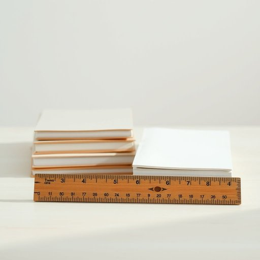

# ruler

<h1 style="font-size: 2.5em; font-weight: 300; letter-spacing: 2px; margin: 0; color: #2c3e50;">
/ˈrulər/
</h1>

---

---

## 例句

Could you please hand me the ruler that’s lying next to the pile of notebooks on the kitchen table, the one with the chipped edge and faded measurements, because I need to draw some precise lines for my DIY project before dinner?

*Could(/kʊd/) you(/ju/) please(/pliz/) hand(/hænd/) me(/mi/) the(/ðə/) ruler(/ˈrulər/) that’s(/that’s*/) lying(/laɪɪŋ/) next(/nɛkst/) to(/tɪ/) the(/ðə/) pile(/paɪl/) of(/əv/) notebooks(/ˈnoʊtˌbʊks/) on(/ɔn/) the(/ðə/) kitchen(/ˈkɪʧən/) table,(/ˈteɪbəl,/) the(/ðə/) one(/wən/) with(/wɪθ/) the(/ðə/) chipped(/ʧɪpt/) edge(/ɛʤ/) and(/ənd/) faded(/ˈfeɪdɪd/) measurements,(/ˈmɛʒərmənts,/) because(/bɪˈkəz/) I(/aɪ/) need(/nid/) to(/tɪ/) draw(/drɔ/) some(/səm/) precise(/prɪˈsaɪs/) lines(/laɪnz/) for(/fər/) my(/maɪ/) DIY(/diy*/) project(/ˈprɑʤɛkt/) before(/ˌbiˈfɔr/) dinner?(/ˈdɪnər?/)*

**翻译：** 你能把厨房桌子上那堆笔记本旁边的尺子递给我吗？就是那把边角有些缺损、刻度已经褪色的尺子，因为我需要在晚饭前为我的DIY项目画一些精确的直线。

---

## 解释

英语单词“ruler”在家居生活用品语境中作为名词，主要指“尺子”，即用于测量长度或在绘图时辅助画直线的工具，常见于学习、办公或家庭环境中，如书桌上的塑料尺、木质直尺等。具体使用场合包括学校课堂、家庭作业、办公室绘图等，其语境一般较为正式且具体，强调测量功能。英语学习者在使用“ruler”时需要注意其作为可数名词的用法，复数形式为“rulers”，常见搭配有“一把12英寸的尺子”（a 12-inch ruler）、“测量尺”（measuring ruler）、“塑料尺”（plastic ruler）等。另外，“ruler”除表示测量工具外，还可指“统治者”，但在家居生活用品语境中应避免混淆；在表达时可通过上下文区分。词源上，“ruler”源自拉丁语“regula”，意为“规则、直尺”，通过古法语进入英语，早期即指测量工具，后引申为统治者，因为统治者需“划定规则”。在中文语境下，“ruler”准确翻译为“尺子”，强调其物理工具属性，不应混淆为“统治者”或带有权力意味的词。此词在家居用品描述中无褒贬含义，属于中性词汇，文化内涵简单，主要体现实用性和学术辅助工具的价值。

---

<small style="color: #999; font-size: 0.9em;">2025-07-17 06:22:40</small>

