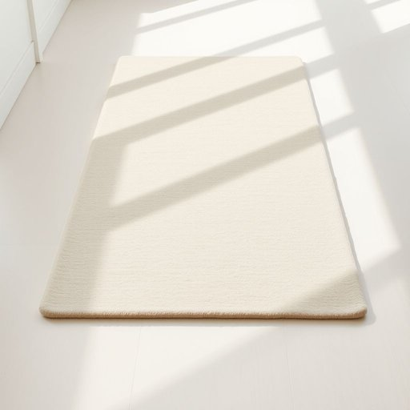

# runner

<h1 style="font-size: 2.5em; font-weight: 300; letter-spacing: 2px; margin: 0; color: #2c3e50;">
/ˈrənər/
</h1>

---

---

## 例句

Before we host the dinner party next weekend, could you please make sure the new woollen runner, which Mum specially bought to brighten up the hallway carpet and protect it from muddy shoes, is properly laid out and free of any wrinkles or creases?

*Before(/ˌbiˈfɔr/) we(/wi/) host(/hoʊst/) the(/ðə/) dinner(/ˈdɪnər/) party(/ˈpɑrti/) next(/nɛkst/) weekend,(/ˈwiˌkɪnd,/) could(/kʊd/) you(/ju/) please(/pliz/) make(/meɪk/) sure(/ʃʊr/) the(/ðə/) new(/nu/) woollen(/ˈwʊlən/) runner,(/ˈrənər,/) which(/wɪʧ/) Mum(/məm/) specially(/ˈspɛʃəli/) bought(/bɔt/) to(/tɪ/) brighten(/ˈbraɪtən/) up(/əp/) the(/ðə/) hallway(/ˈhɔlˌweɪ/) carpet(/ˈkɑrpət/) and(/ənd/) protect(/prəˈtɛkt/) it(/ɪt/) from(/frəm/) muddy(/ˈmədi/) shoes,(/ʃuz,/) is(/ɪz/) properly(/ˈprɑpərli/) laid(/leɪd/) out(/aʊt/) and(/ənd/) free(/fri/) of(/əv/) any(/ˈɛni/) wrinkles(/ˈrɪŋkəlz/) or(/ər/) creases?(/ˈkrisɪz?/)*

**翻译：** 在我们下周末举办晚宴前，能否请你确认一下新买的毛线地毯走道毯是否已经铺好，并且没有任何皱褶？这条地毯是妈妈特意买来点亮走廊地毯并保护它免受泥鞋污染的。

---

## 解释

英语单词“runner”在家居生活用品场景中作为名词，通常指的是“过道地毯”或“长条地毯”，这是一种狭长且铺设于房间走道、楼梯或柜台上的地毯，既有装饰作用，也能保护地面、防滑和减少噪音。在具体使用场合上，如在描述家居布置或室内装饰时，人们常说“hallway runner”（走廊地毯）、“stair runner”（楼梯地毯）或“table runner”（桌旗，虽为另一类家居用品，但同样称为runner），这些词组属于常见搭配。英语学习者在使用“runner”时需注意其作为可数名词时，需要根据上下文决定复数形式“runners”，且在不同搭配中其含义会有所变化，譬如“table runner”指的是装饰桌面的长条布，而非地毯。词汇“runner”源自古英语“rinnan”，意为“流动、奔跑”，在现代英语中引申出“跑步者”、“传递者”等含义，而家居用法则借指狭长、条状物体，因此引申为“长条地毯”。在中文语境下，该词通常准确翻译为“过道地毯”或“长条地毯”，强调其形状和用途，避免与其他“runner”意义混淆。总体来看，作为家居用品的“runner”属于中性词汇，无明显褒贬色彩，但在文化层面体现出对空间功能性与美观性的结合，是家居软装中常见且实用的元素。

---

<small style="color: #999; font-size: 0.9em;">2025-07-17 06:22:40</small>

