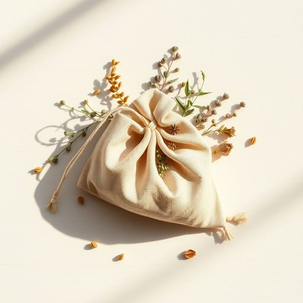

# sachet

<h1 style="font-size: 2.5em; font-weight: 300; letter-spacing: 2px; margin: 0; color: #2c3e50;">
/sæˈʃeɪ/
</h1>

---

---

## 例句

Although the delicate sachet, infused with rare herbs and meticulously crafted by hand, was small enough to fit discreetly in her pocket, it carried an enchanting fragrance that seemed to evoke memories of distant gardens and forgotten summers, captivating everyone who happened to pass by.

*Although(/ˌɔlˈðoʊ/) the(/ðə/) delicate(/ˈdɛləkət/) sachet,(/sæˈʃeɪ,/) infused(/ˌɪnfˈjuzd/) with(/wɪθ/) rare(/rɛr/) herbs(/ərbz/) and(/ənd/) meticulously(/məˈtɪkjələsli/) crafted(/ˈkræftɪd/) by(/baɪ/) hand,(/hænd,/) was(/wɑz/) small(/smɔl/) enough(/ɪˈnəf/) to(/tɪ/) fit(/fɪt/) discreetly(/dɪˈskritli/) in(/ɪn/) her(/hər/) pocket,(/ˈpɑkət,/) it(/ɪt/) carried(/ˈkɛrid/) an(/ən/) enchanting(/ɛnˈʧænɪŋ/) fragrance(/ˈfreɪgrəns/) that(/ðət/) seemed(/simd/) to(/tɪ/) evoke(/ɪˈvoʊk/) memories(/ˈmɛməriz/) of(/əv/) distant(/ˈdɪstənt/) gardens(/ˈgɑrdənz/) and(/ənd/) forgotten(/fərˈgɑtən/) summers,(/ˈsəmərz,/) captivating(/ˈkæptɪˌveɪtɪŋ/) everyone(/ˈɛvriˌwən/) who(/hu/) happened(/ˈhæpənd/) to(/tɪ/) pass(/pæs/) by.(/baɪ./)*

**翻译：** 虽然那个细腻的小香袋，注入了珍稀药草并由手工精心制作，体积小巧到可以悄然放入口袋，却散发出一种迷人的香气，仿佛唤起遥远花园和被遗忘夏日的记忆，吸引着所有偶然路过的人。

---

## 解释

英语单词"sachet"在家居生活用品的语境中作为名词，指的是一种小袋子，通常装有芳香物质（如干燥花瓣、香料或香料混合物），常用于放置在衣柜、抽屉或房间中以散发香气，达到防潮、防虫或增添清新气味的作用。这类sachet一般体积小巧，便于携带和放置，常见于家居香氛和整理清洁的场合。学习者使用该词时需注意其复数形式为"sachets"，在具体表达中常与动词"put"（放置）、"place"（摆放）、"fill"（装填）等搭配，如"put a sachet in the drawer"或"use scented sachets to freshen clothes"。此外，sachet多指含粉状或颗粒状物质的小袋，不应用于液体包装。其词源源自法语，原义为“小袋子”，来自拉丁语"saccus"（袋子），传入英语后专指装香料或芳香材料的小袋，这也反映了其传统用途。中文中准确翻译为“香袋”或“小香包”，强调其装载香料、用于衣物或室内芳香的功能，属于中性词汇，无褒贬之意，但在文化使用中透露出一种注重生活细节和情调的审美含义。

---

<small style="color: #999; font-size: 0.9em;">2025-07-17 06:22:40</small>

