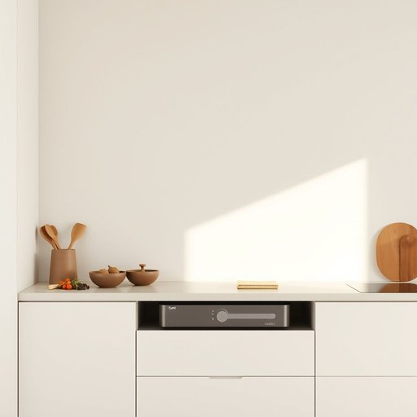

# safes

<h1 style="font-size: 2.5em; font-weight: 300; letter-spacing: 2px; margin: 0; color: #2c3e50;">
/seɪfs/
</h1>

---

---

## 例句

In the bustling kitchen, the safe installed beneath the countertop not only protects the expensive spices and rare herbs but also serves as a quiet guardian for the secret recipes handed down through generations, embodying the family's heritage and culinary passion.

*In(/ɪn/) the(/ðə/) bustling(/ˈbəsəlɪŋ/) kitchen,(/ˈkɪʧən,/) the(/ðə/) safe(/seɪf/) installed(/ˌɪnˈstɔld/) beneath(/bɪˈniθ/) the(/ðə/) countertop(/ˈkaʊntərˌtɑp/) not(/nɑt/) only(/ˈoʊnli/) protects(/prəˈtɛkts/) the(/ðə/) expensive(/ɪkˈspɛnsɪv/) spices(/ˈspaɪsɪz/) and(/ənd/) rare(/rɛr/) herbs(/ərbz/) but(/bət/) also(/ˈɔlsoʊ/) serves(/sərvz/) as(/ɛz/) a(/ə/) quiet(/kwaɪət/) guardian(/ˈgɑrdiən/) for(/fər/) the(/ðə/) secret(/ˈsikrɪt/) recipes(/ˈrɛsəpiz/) handed(/ˈhændɪd/) down(/daʊn/) through(/θru/) generations,(/ˌʤɛnərˈeɪʃənz,/) embodying(/ɪmˈbɑdiɪŋ/) the(/ðə/) family's(/ˈfæməliz/) heritage(/ˈhɛrɪtɪʤ/) and(/ənd/) culinary(/ˈkjulɪˌnɛri/) passion.(/ˈpæʃən./)*

**翻译：** 在这间忙碌的厨房里，安装在操作台下方的保险箱不仅保护着昂贵的香料和珍稀的药草，更默默守护着世代相传的秘方，体现了这个家庭的传承与烹饪热情。

---

## 解释

英语单词“safes”作为名词，指的是“保险箱”或“安全柜”，通常用于家居生活用品场景中，表示用于存放贵重物品、现金、重要文件等以防盗窃或火灾损坏的坚固容器。具体使用场合包括家庭、办公室或商业场所中保护财产安全的情境，如“put valuables in the safes”（把贵重物品放入保险箱）。英语学习者在使用“safes”时应注意其为“safe”的复数形式，属于可数名词，因此在表示多个保险箱时需用“safes”，而非不可数形式；此外，常见搭配有“fireproof safes”（防火保险箱）、“combination safes”（密码保险箱）、“lock safes”（锁柜）等，学习时注意搭配词汇能提升表达准确性。词源方面，“safe”源自中古英语，最初意指“安全的”，后来引申指能保障财物安全的容器，这一含义逐渐固定为保险箱的名称。在中文语境中，“safes”准确翻译为“保险箱”，强调整体功能为防盗或防灾保护，且在家庭、办公场所均适用，无明显褒贬色彩，属于中性词汇，反映了一种安全防护意识和财产保护的文化需求。

---

<small style="color: #999; font-size: 0.9em;">2025-07-17 06:22:40</small>

