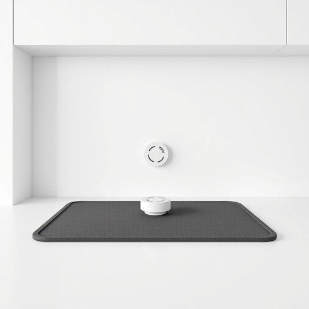

# safety

<h1 style="font-size: 2.5em; font-weight: 300; letter-spacing: 2px; margin: 0; color: #2c3e50;">
/ˈseɪfti/
</h1>

---

---

## 例句

Considering the potential hazards in the kitchen, such as slippery floors and hot surfaces, safety must be prioritized by installing non-slip mats, keeping sharp knives out of children’s reach, and regularly testing smoke detectors to prevent any unfortunate accidents.

*Considering(/kənˈsɪdərɪŋ/) the(/ðə/) potential(/pəˈtɛnʃəl/) hazards(/ˈhæzərdz/) in(/ɪn/) the(/ðə/) kitchen,(/ˈkɪʧən,/) such(/səʧ/) as(/ɛz/) slippery(/sˈlɪpəri/) floors(/flɔrz/) and(/ənd/) hot(/hɑt/) surfaces,(/ˈsərfəsɪz,/) safety(/ˈseɪfti/) must(/məst/) be(/bi/) prioritized(/praɪˈɔrəˌtaɪzd/) by(/baɪ/) installing(/ˌɪnˈstɔlɪŋ/) non-slip(/non-slip*/) mats,(/mæts,/) keeping(/ˈkipɪŋ/) sharp(/ʃɑrp/) knives(/naɪvz/) out(/aʊt/) of(/əv/) children’s(/children’s*/) reach,(/riʧ,/) and(/ənd/) regularly(/ˈrɛgjələrli/) testing(/ˈtɛstɪŋ/) smoke(/smoʊk/) detectors(/dɪˈtɛktərz/) to(/tɪ/) prevent(/prɪˈvɛnt/) any(/ˈɛni/) unfortunate(/ənˈfɔrʧənət/) accidents.(/ˈæksədənts./)*

**翻译：** 考虑到厨房中可能存在的危险，比如地面湿滑和高温表面，必须优先保障安全，安装防滑垫，将锋利的刀具放置在儿童够不着的地方，并定期检测烟雾报警器，以防发生不幸事故。

---

## 解释

英语单词“safety”作为名词，在家居生活用品场景中主要指“安全性”或“安全措施”，强调保护人们免受伤害、事故或危险的状态或条件。例如，当讨论儿童安全锁、防滑垫、烟雾报警器等产品时，常用“safety”来描述这些用品保障使用者免受潜在风险的功能。英语学习者在使用“safety”时需注意其不可数名词的用法，通常不加复数形式，常用搭配有“safety measures”（安全措施）、“safety features”（安全特征）、“safety standards”（安全标准）以及“ensure safety”（确保安全）等，表达时通常关注如何维持或提升安全状态。此外，“safety”常与介词“in”或“of”连用，如“safety in the home”（家中的安全）、“safety of children”（儿童的安全）。词源方面，“safety”起源于中古法语“safe”加后缀“-ty”，意指安全的状态或性质，本身带有积极、正面的褒义色彩，强调无危险或风险。在中文语境中，“safety”通常被准确翻译为“安全”或“安全性”，强调保障人身健康和生命财产不受威胁的条件与状态，符合同义词“安全”和“保障”的概念，使用时应避免与“安全感”过度混淆，因为“safety”更偏向具体的保护和预防措施，而非主观感受。在家居用品领域，理解和使用“safety”有助于消费者识别和评价产品的安全性能，对提升居家生活品质和防范潜在危险具有重要意义。

---

<small style="color: #999; font-size: 0.9em;">2025-07-17 06:22:40</small>

