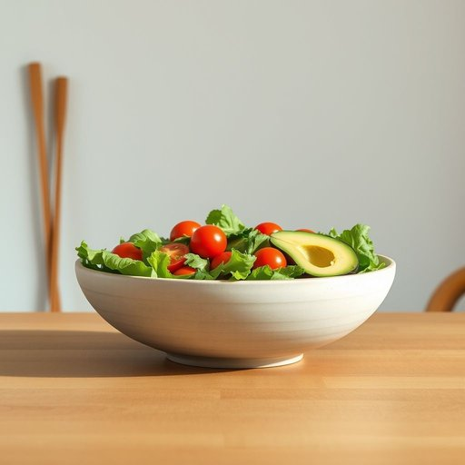

# salad-bowl

<h1 style="font-size: 2.5em; font-weight: 300; letter-spacing: 2px; margin: 0; color: #2c3e50;">
/salad-bowl*/
</h1>

---

---

## 例句

After carefully arranging the fresh greens, cherry tomatoes, and slices of avocado in the large ceramic salad-bowl that my grandmother had gifted me last Christmas, I placed it at the centre of the dinner table, knowing it would not only serve as a functional dish but also as an elegant centerpiece that sparked conversation about family traditions and healthy eating habits.

*After(/ˈæftər/) carefully(/ˈkɛrfəli/) arranging(/ərˈeɪnʤɪŋ/) the(/ðə/) fresh(/frɛʃ/) greens,(/grinz,/) cherry(/ˈʧɛri/) tomatoes,(/təˈmɑtoʊz,/) and(/ənd/) slices(/sˈlaɪsɪz/) of(/əv/) avocado(/ˌævəˈkɑdoʊ/) in(/ɪn/) the(/ðə/) large(/lɑrʤ/) ceramic(/sərˈæmɪk/) salad-bowl(/salad-bowl*/) that(/ðət/) my(/maɪ/) grandmother(/ˈgrændˌməðər/) had(/hæd/) gifted(/ˈgɪftɪd/) me(/mi/) last(/læst/) Christmas,(/ˈkrɪsməs,/) I(/aɪ/) placed(/pleɪst/) it(/ɪt/) at(/æt/) the(/ðə/) centre(/ˈsɛntər/) of(/əv/) the(/ðə/) dinner(/ˈdɪnər/) table,(/ˈteɪbəl,/) knowing(/noʊɪŋ/) it(/ɪt/) would(/wʊd/) not(/nɑt/) only(/ˈoʊnli/) serve(/sərv/) as(/ɛz/) a(/ə/) functional(/ˈfəŋkʃənəl/) dish(/dɪʃ/) but(/bət/) also(/ˈɔlsoʊ/) as(/ɛz/) an(/ən/) elegant(/ˈɛləgənt/) centerpiece(/ˈsɛntərˌpis/) that(/ðət/) sparked(/spɑrkt/) conversation(/ˌkɑnvərˈseɪʃən/) about(/əˈbaʊt/) family(/ˈfæməli/) traditions(/trəˈdɪʃənz/) and(/ənd/) healthy(/ˈhɛlθi/) eating(/ˈitɪŋ/) habits.(/ˈhæbəts./)*

**翻译：** 我将新鲜的绿叶蔬菜、樱桃番茄和鳄梨片细心地摆放在祖母去年圣诞节送我的那只大陶瓷沙拉碗里，然后将它置于餐桌中央，心知这不仅是一道实用的菜肴，更是一件优雅的餐桌中心装饰，能够引发关于家庭传统和健康饮食习惯的交流。

---

## 解释

英语单词“salad-bowl”在家居生活用品场景中作为名词，通常指一种用来盛放沙拉的碗，一般材质多样，包括玻璃、不锈钢、陶瓷或塑料，适合家庭厨房、餐厅或野餐等场合使用，强调其实用性和容量。英语学习者在使用该词时需注意其复合名词结构，通常复数形式为“salad bowls”，前面可加定冠词或限定词，且该词往往与动词“use”、“serve”或形容词如“large”、“glass”等搭配出现，避免用作抽象比喻时产生歧义。“salad-bowl”一词源于其字面含义，由“salad”（沙拉）和“bowl”（碗）组合而成，最初指厨房中实际盛沙拉的容器，后因形象生动被引申来表示文化多元融合的社会理论，但在家居用品语境下仍以实体物品为主。在中文语境中，“salad-bowl”准确翻译为“沙拉碗”或“拌沙拉的碗”，理解时应避免文化隐喻，将其视为具体的厨房用品。该词在家居用品语境中无褒贬含义，仅用于描述器具，使用时应根据具体语境区分其字面和比喻意义。

---

<small style="color: #999; font-size: 0.9em;">2025-07-17 06:22:40</small>

