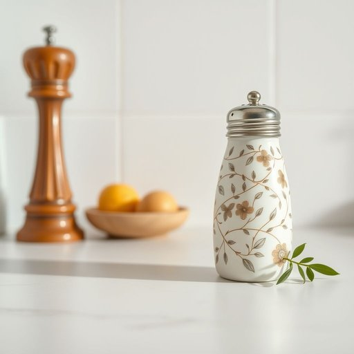

# salt-shaker

<h1 style="font-size: 2.5em; font-weight: 300; letter-spacing: 2px; margin: 0; color: #2c3e50;">
/salt-shaker*/
</h1>

---

---

## 例句

Could you please pass me the salt-shaker that's sitting next to the pepper mill on the kitchen counter, the one with the intricate floral design that Grandma brought back from her trip to Cornwall last summer?

*Could(/kʊd/) you(/ju/) please(/pliz/) pass(/pæs/) me(/mi/) the(/ðə/) salt-shaker(/salt-shaker*/) that's(/ðæts/) sitting(/ˈsɪtɪŋ/) next(/nɛkst/) to(/tɪ/) the(/ðə/) pepper(/ˈpɛpər/) mill(/mɪl/) on(/ɔn/) the(/ðə/) kitchen(/ˈkɪʧən/) counter,(/ˈkaʊntər,/) the(/ðə/) one(/wən/) with(/wɪθ/) the(/ðə/) intricate(/ˈɪntrəkət/) floral(/ˈflɔrəl/) design(/dɪˈzaɪn/) that(/ðət/) Grandma(/ˈgrændmɑ/) brought(/brɔt/) back(/bæk/) from(/frəm/) her(/hər/) trip(/trɪp/) to(/tɪ/) Cornwall(/ˈkɔrnwɔl/) last(/læst/) summer?(/ˈsəmər?/)*

**翻译：** 请把厨房台面上放在胡椒磨旁边的盐罐递给我，就是那个带有精致花卉图案的盐罐，是奶奶去年夏天从康沃尔旅行带回来的。

---

## 解释

英语单词'salt-shaker'作为名词，指的是家居生活中用于盛放并撒盐的小容器，通常设计为方便手持和控制盐量，常见于厨房或餐桌上，用于调味，具体使用场合多为家庭用餐、餐厅服务或烹饪过程中需要均匀撒盐时的工具，英语学习者在使用该词时应注意，它是一个复合名词，由“salt”（盐）和“shaker”（摇动器）组成，通常作为单数或复数形式使用时需要根据谓语动词变换一致，如“the salt-shaker is on the table”或“the salt-shakers are on the shelf”，此外，‘salt-shaker’常与“pepper-shaker”（胡椒瓶）一同出现，形成厨具类别的固定搭配，表达上要避免将其与动词“shake”直接混淆，词源方面，该词源自组合词机制，其中“shaker”指可摇晃以撒出内容物的容器，“salt”表明其中盛放的物质，即“盐”，整体反映功能与用途，中文语境准确翻译为“盐瓶”或“撒盐罐”，理解时应明确它是盛盐的器皿而非盐的别称，无明显褒贬含义，属于中性且日常生活频繁接触的家居用品词汇，没有特殊文化色彩或隐喻，主要用于描述实物，有助于英语学习者在厨房用具类词汇中准确认知和应用。

---

<small style="color: #999; font-size: 0.9em;">2025-07-17 06:22:40</small>

