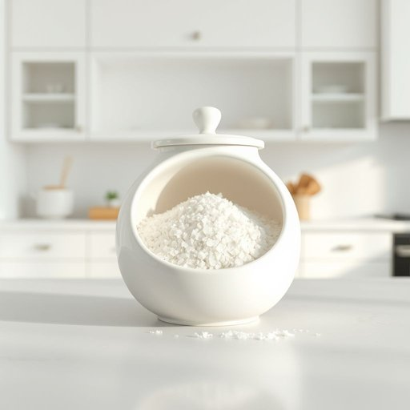

# salt

<h1 style="font-size: 2.5em; font-weight: 300; letter-spacing: 2px; margin: 0; color: #2c3e50;">
/sɔlt/
</h1>

---

---

## 例句

Could you please pass me the salt, which is sitting next to the pepper shaker on the kitchen counter, so that I can properly season the stew I've been simmering for the past hour?

*Could(/kʊd/) you(/ju/) please(/pliz/) pass(/pæs/) me(/mi/) the(/ðə/) salt,(/sɔlt,/) which(/wɪʧ/) is(/ɪz/) sitting(/ˈsɪtɪŋ/) next(/nɛkst/) to(/tɪ/) the(/ðə/) pepper(/ˈpɛpər/) shaker(/ˈʃeɪkər/) on(/ɔn/) the(/ðə/) kitchen(/ˈkɪʧən/) counter,(/ˈkaʊntər,/) so(/soʊ/) that(/ðət/) I(/aɪ/) can(/kən/) properly(/ˈprɑpərli/) season(/ˈsizən/) the(/ðə/) stew(/stu/) I've(/aɪv/) been(/bɪn/) simmering(/ˈsɪmərɪŋ/) for(/fər/) the(/ðə/) past(/pæst/) hour?(/aʊər?/)*

**翻译：** 请你把厨房台面上胡椒瓶旁边的盐递给我，好让我为这锅已经炖了一个小时的炖菜恰当调味。

---

## 解释

英语单词“salt”作为名词在家居生活用品场景中，通常指食盐，即用来调味或保存食物的白色晶体状物质，常见于厨房中，用于烹饪和餐桌调味；它也可以指其他类型的盐，如洗衣盐或浴盐，但一般家庭环境中首要指食盐。学习者使用“salt”时需注意其不可数名词属性，通常不加复数形式（如不说“salts”表示一般的食盐），但当指不同种类的盐或化学盐类时，可以用复数；常见搭配包括“table salt”（食盐）、“sea salt”（海盐）、“iodized salt”（加碘盐）、“to salt food”（给食物加盐）等，短语“salt and pepper”常用于指调味料组合，表达时也常见“a pinch of salt”（一撮盐）。词源上，“salt”源自古英语“sealt”，与拉丁语“sal”和希腊语“háls”均有关联，反映出盐在人类文明中的重要地位，被广泛用作食物防腐和调味品。中文语境中“salt”准确翻译为“盐”，强调其在饮食和家居日常中的用途，没有褒贬色彩，但在文化层面，盐有时象征纯洁和财富，且“盐”在中西饮食文化中均为基础生活必需品，语言使用中应避免混淆其化学和日常食用的区别。

---

<small style="color: #999; font-size: 0.9em;">2025-07-17 06:22:40</small>

