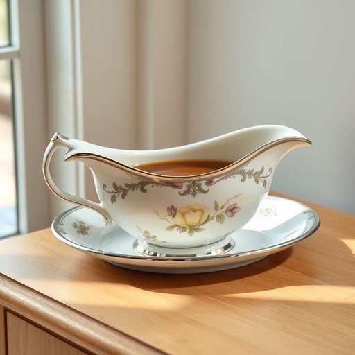

# sauceboat

<h1 style="font-size: 2.5em; font-weight: 300; letter-spacing: 2px; margin: 0; color: #2c3e50;">
/sauceboat*/
</h1>

---

---

## 例句

Could you please pass me the sauceboat that’s on the sideboard by the window, the one with the delicate floral pattern and the silver trim, because I want to pour the gravy smoothly without spilling it onto the tablecloth during tonight’s roast dinner?

*Could(/kʊd/) you(/ju/) please(/pliz/) pass(/pæs/) me(/mi/) the(/ðə/) sauceboat(/sauceboat*/) that’s(/that’s*/) on(/ɔn/) the(/ðə/) sideboard(/sideboard*/) by(/baɪ/) the(/ðə/) window,(/ˈwɪndoʊ,/) the(/ðə/) one(/wən/) with(/wɪθ/) the(/ðə/) delicate(/ˈdɛləkət/) floral(/ˈflɔrəl/) pattern(/ˈpætərn/) and(/ənd/) the(/ðə/) silver(/ˈsɪlvər/) trim,(/trɪm,/) because(/bɪˈkəz/) I(/aɪ/) want(/wɔnt/) to(/tɪ/) pour(/pɔr/) the(/ðə/) gravy(/ˈgreɪvi/) smoothly(/sˈmuðli/) without(/wɪˈθaʊt/) spilling(/ˈspɪlɪŋ/) it(/ɪt/) onto(/ˈɔntu/) the(/ðə/) tablecloth(/ˈteɪbəlˌklɔθ/) during(/ˈdʊrɪŋ/) tonight’s(/tonight’s*/) roast(/roʊst/) dinner?(/ˈdɪnər?/)*

**翻译：** 请你把窗边餐边柜上的那个调味汁船递给我好吗？就是那个带有精致花卉图案和银色镶边的，因为我想在今晚的烤肉晚宴上顺畅地倒汁，不弄洒到桌布上。

---

## 解释

单词'sauceboat'作为名词，指的是一种家居生活用品，即用于盛装和盛倒调味汁（通常是肉汁或调味酱）的器具，形状类似小船，带有把手和倾倒口，方便将调味汁浇淋到食物上。它常出现在正式的餐桌场合或者家庭聚餐中，用于盛放如肉汁、奶油汁等，目的是便于分配和保持调味汁的温度和美观。在英语语法上，作为可数名词，学习者要注意单复数形式（sauceboat/sauceboats）并常见的搭配有“a silver sauceboat”（银质调味汁船）、“a porcelain sauceboat”（瓷质调味汁船）以及动词搭配如“pass the sauceboat”（把调味汁船递过来）、“pour from the sauceboat”（从调味汁船中倒出），表达清晰且自然。词源上，sauceboat来自18世纪英语，“sauce”意指调味汁，“boat”比喻其形状像小船，因其流线型设计便于倒酱汁，这种称呼在英国家居用品中尤为常见。中文中准确翻译为“调味汁船”或“调味汁盅”，强调其船状器皿的功能和用途，常见于正式餐具或传统家居描述，无特殊褒贬或文化内涵，多为中性且带有一定正式礼仪色彩，反映了西式餐桌文化中的细节与讲究。

---

<small style="color: #999; font-size: 0.9em;">2025-07-17 06:22:40</small>

