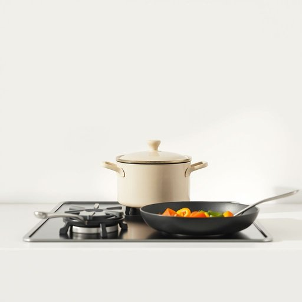

# saucepan

<h1 style="font-size: 2.5em; font-weight: 300; letter-spacing: 2px; margin: 0; color: #2c3e50;">
/ˈsɔˌspæn/
</h1>

---

---

## 例句

Could you please pass me the large saucepan that’s sitting on the stove next to the frying pan, so I can start boiling the vegetables while you chop the onions?

*Could(/kʊd/) you(/ju/) please(/pliz/) pass(/pæs/) me(/mi/) the(/ðə/) large(/lɑrʤ/) saucepan(/ˈsɔˌspæn/) that’s(/that’s*/) sitting(/ˈsɪtɪŋ/) on(/ɔn/) the(/ðə/) stove(/stoʊv/) next(/nɛkst/) to(/tɪ/) the(/ðə/) frying(/fraɪɪŋ/) pan,(/pæn,/) so(/soʊ/) I(/aɪ/) can(/kən/) start(/stɑrt/) boiling(/ˈbɔɪlɪŋ/) the(/ðə/) vegetables(/ˈvɛʤtəbəlz/) while(/waɪl/) you(/ju/) chop(/ʧɑp/) the(/ðə/) onions?(/ˈənjənz?/)*

**翻译：** 请把炉子上靠近煎锅的大汤锅递给我，好让我开始煮蔬菜，你则先帮忙切洋葱好吗？

---

## 解释

英语单词'saucepan'在家居生活用品场景中作为名词，指一种带有长柄且通常带盖的小型深平底锅，主要用于烹饪加热液体或制作酱汁，如煮汤、煨菜或加热牛奶等。具体使用场合多为厨房烹饪时，尤其涉及需要慢火加热或煮制需要保留液体的菜肴或调味汁。英语学习者在使用'saucepan'时应注意它通常作为可数名词出现，复数形式为'saucepans'，且习惯搭配动词有“use a saucepan”（使用汤锅）、“heat in a saucepan”（在汤锅中加热）等；在表达时常与食材、烹饪动作或烹饪器具搭配，如“a small saucepan”、“a saucepan with a lid”。此外，'saucepan'可与量词'a'或数字连用。该词源于中古英语，结合“sauce”（酱汁）与“pan”（锅）两个词根，表示专门用于熬制酱汁的锅具，这一词源反映了其功能特征和使用目的。中文语境中，'saucepan'准确翻译为“平底锅”或“汤锅”，不过更具体应理解为“小汤锅”或“炖锅”，区别于一般的炒锅或煎锅。需要注意的是，‘saucepan’在英语中没有褒贬色彩，也无特殊文化隐喻，属于日常厨房生活中的常见工具名称，其使用与描述主要是实用和中性的。

---

<small style="color: #999; font-size: 0.9em;">2025-07-17 06:22:40</small>

