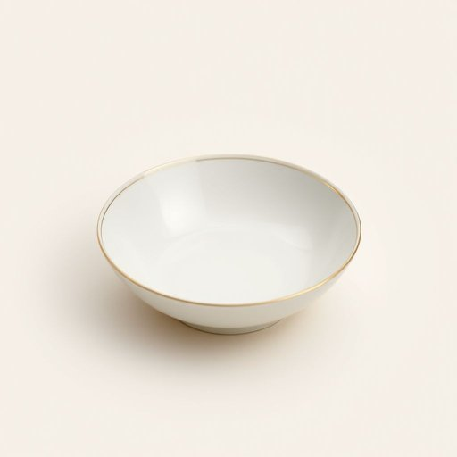

# saucer

<h1 style="font-size: 2.5em; font-weight: 300; letter-spacing: 2px; margin: 0; color: #2c3e50;">
/ˈsɔsər/
</h1>

---

---

## 例句

Could you please pass me the saucer that matches this delicate porcelain teacup, the one with the intricate floral pattern and gold trim, so I can put this spoon down without making a mess on the tablecloth, which I just spent ages ironing?

*Could(/kʊd/) you(/ju/) please(/pliz/) pass(/pæs/) me(/mi/) the(/ðə/) saucer(/ˈsɔsər/) that(/ðət/) matches(/ˈmæʧɪz/) this(/ðɪs/) delicate(/ˈdɛləkət/) porcelain(/ˈpɔrsələn/) teacup,(/ˈtiˌkəp,/) the(/ðə/) one(/wən/) with(/wɪθ/) the(/ðə/) intricate(/ˈɪntrəkət/) floral(/ˈflɔrəl/) pattern(/ˈpætərn/) and(/ənd/) gold(/goʊld/) trim,(/trɪm,/) so(/soʊ/) I(/aɪ/) can(/kən/) put(/pʊt/) this(/ðɪs/) spoon(/spun/) down(/daʊn/) without(/wɪˈθaʊt/) making(/ˈmeɪkɪŋ/) a(/ə/) mess(/mɛs/) on(/ɔn/) the(/ðə/) tablecloth,(/ˈteɪbəlˌklɔθ,/) which(/wɪʧ/) I(/aɪ/) just(/ʤɪst/) spent(/spɛnt/) ages(/ˈeɪʤɪz/) ironing?(/ˈaɪərnɪŋ?/)*

**翻译：** 您能把那只和这只精致瓷茶杯相配的茶托递给我吗？就是那只带有复杂花卉图案和金边的，好让我能把勺子放下，而不会弄脏我刚刚花了好久熨平的桌布。

---

## 解释

英语单词"saucer"在家居生活用品语境中作为名词，指的是杯子下方用来承载杯子并收集溢出液体的小盘子，常见于茶杯或咖啡杯的配套器皿，使用场合主要是在饮茶、喝咖啡或用餐时放置杯子以防止桌面弄脏。学习者需注意，“saucer”通常是可数名词，可以与冠词连用，如"a saucer"或"the saucer"，且常与“tea”“coffee”等名词搭配，如"a tea saucer"或"coffee cup and saucer"表示一套杯碟。此外，“saucer”还可用于比喻，例如“flying saucer”指飞碟，属于词汇的延伸用法。词源方面，“saucer”源自中古英语“sawcer”，由“sauce”（酱汁）加后缀“-er”构成，最初指用来盛酱汁的小碟，后来演变为现代含义的小盘子。中文中精准翻译为“茶托”或“杯碟”，强调其辅助茶杯、咖啡杯使用的功能，通常无褒贬色彩，是日常生活中常见的餐具之一。此词在文化内涵上较为中性，没有特殊褒义或贬义，主要体现礼仪和生活细节中的整洁和美观。

---

<small style="color: #999; font-size: 0.9em;">2025-07-17 06:22:40</small>

