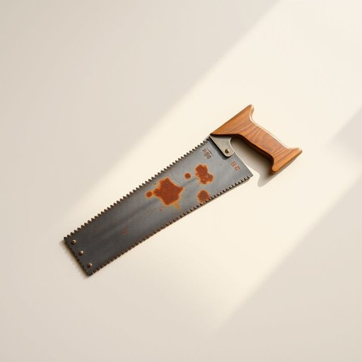

# saw

<h1 style="font-size: 2.5em; font-weight: 300; letter-spacing: 2px; margin: 0; color: #2c3e50;">
/sɔ/
</h1>

---

---

## 例句

I found the old saw, which has a slightly rusted but still sharp blade, tucked away in the dusty corner of the shed, and I’m planning to use it this weekend to carefully cut the wooden boards for the new garden bench, so that it fits perfectly in the space we cleared last month.

*I(/aɪ/) found(/faʊnd/) the(/ðə/) old(/oʊld/) saw,(/sɔ,/) which(/wɪʧ/) has(/həz/) a(/ə/) slightly(/sˈlaɪtli/) rusted(/ˈrəstɪd/) but(/bət/) still(/stɪl/) sharp(/ʃɑrp/) blade,(/bleɪd,/) tucked(/təkt/) away(/əˈweɪ/) in(/ɪn/) the(/ðə/) dusty(/ˈdəsti/) corner(/ˈkɔrnər/) of(/əv/) the(/ðə/) shed,(/ʃɛd,/) and(/ənd/) I’m(/i’m*/) planning(/ˈplænɪŋ/) to(/tɪ/) use(/juz/) it(/ɪt/) this(/ðɪs/) weekend(/ˈwiˌkɪnd/) to(/tɪ/) carefully(/ˈkɛrfəli/) cut(/kət/) the(/ðə/) wooden(/ˈwʊdən/) boards(/bɔrdz/) for(/fər/) the(/ðə/) new(/nu/) garden(/ˈgɑrdən/) bench,(/bɛnʧ,/) so(/soʊ/) that(/ðət/) it(/ɪt/) fits(/fɪts/) perfectly(/ˈpərfəktli/) in(/ɪn/) the(/ðə/) space(/speɪs/) we(/wi/) cleared(/klɪrd/) last(/læst/) month.(/mənθ./)*

**翻译：** 我在工具棚那个布满灰尘的角落里找到了那把旧锯，锯刃虽然略带锈迹，但依然锋利。这个周末我打算用它，小心翼翼地锯切新的花园长椅用木板，以确保它能完美契合我们上个月清理出来的空间。

---

## 解释

英语单词’saw’作为名词在家居生活用品领域主要指“锯子”，是一种用于切割木材、塑料或金属等材料的手工具或电动工具，常见于家庭装修、家具制作或简单修理时使用。具体使用场合多出现在描述工具箱、车库、工作间或DIY项目环境中，如“The saw is on the workbench”（锯子在工作台上）。学习者需要注意’saw’作为名词时通常为可数名词，复数形式为’saws’，且与不同种类的锯搭配使用，如“hand saw”（手锯）、“circular saw”（圆锯）、“electric saw”（电锯）等；此外，避免将其与动词过去式混淆，需根据句子结构判断词性。词源方面，’saw’源自古英语’sagu’，与德语’säge’同根，意指切割工具，历史悠久，反映了人类早期对工具的创造和应用。中文中准确翻译为“锯子”，指具有锯齿用于切割的工具，在日常生活和工业生产中均常见，无褒贬含义，属于中性词汇，反映具体物品的功能和用途，其文化色彩主要与手工艺和修缮活动相关，体现了实用工具的基础地位。

---

<small style="color: #999; font-size: 0.9em;">2025-07-17 06:22:40</small>

