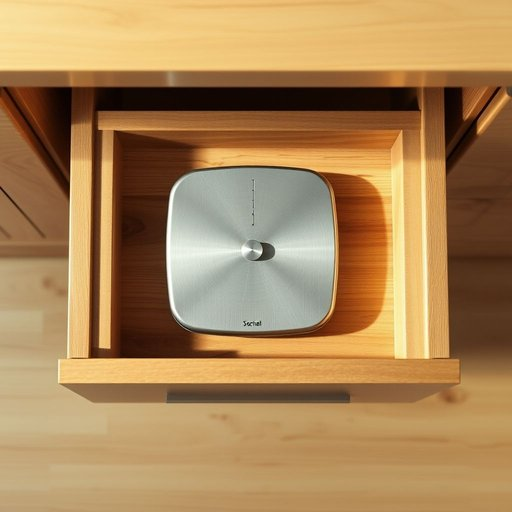

# scale

<h1 style="font-size: 2.5em; font-weight: 300; letter-spacing: 2px; margin: 0; color: #2c3e50;">
/skeɪl/
</h1>

---

---

## 例句

Before cooking dinner, I always check the scale in my kitchen drawer, which, despite its compact size and slightly worn dial, provides a remarkably accurate measurement of ingredients, ensuring my recipes turn out perfectly every time.

*Before(/ˌbiˈfɔr/) cooking(/ˈkʊkɪŋ/) dinner,(/ˈdɪnər,/) I(/aɪ/) always(/ˈɔlˌweɪz/) check(/ʧɛk/) the(/ðə/) scale(/skeɪl/) in(/ɪn/) my(/maɪ/) kitchen(/ˈkɪʧən/) drawer,(/drɔr,/) which,(/wɪʧ,/) despite(/dɪˈspaɪt/) its(/ɪts/) compact(/ˈkɑmpækt/) size(/saɪz/) and(/ənd/) slightly(/sˈlaɪtli/) worn(/wɔrn/) dial,(/daɪəl,/) provides(/prəˈvaɪdz/) a(/ə/) remarkably(/rɪˈmɑrkəbli/) accurate(/ˈækjərət/) measurement(/ˈmɛʒərmənt/) of(/əv/) ingredients,(/ˌɪnˈgridiənts,/) ensuring(/ɪnˈʃʊrɪŋ/) my(/maɪ/) recipes(/ˈrɛsəpiz/) turn(/tərn/) out(/aʊt/) perfectly(/ˈpərfəktli/) every(/ˈɛvəri/) time.(/taɪm./)*

**翻译：** 在烹饪晚餐之前，我总会检查厨房抽屉里的称，尽管它体积小巧且刻度盘略显磨损，却能够提供异常精准的食材测量，确保我的菜谱每次都能完美呈现。

---

## 解释

在家居生活用品的语境中，英语单词“scale”作为名词主要指“称重器”或“体重秤”，即用来测量物体重量，尤其是人体体重的设备，如bathroom scale（浴室秤）。具体使用场合多见于描述家庭环境下的测量器具，如厨房秤用于精确称量食材，体重秤用于监测健康状况。英语学习者需要注意“scale”作为名词时常与动词“weigh”搭配使用，如“use a scale to weigh fruits”（用秤称水果），同时它也可跟数量或尺寸相关的表达搭配，如“a scale of 1:100”（比例尺，虽然这在家居用品场景中较少）。 “Scale”在语法上为可数名词，复数形式为“scales”，但在表示体重秤时常见单数用法。此外，注意避免与表示“规模、比例”的“scale”混淆，这两个意义虽同形但用法和语境差异较大。词源上，“scale”源自拉丁语“scala”，意为梯子或阶梯，后引申为测量或等级的含义，这与其表达的分层或数字单位概念相关，家居用品中的称重秤通过数字刻度体现“scale”的本义。中文语境中，“scale”准确翻译应结合具体含义，指代家用称重设备时译为“秤”、“称”，使用时注意区分“体重秤”、“厨房称”等具体类别。该词在家居用品场景中通常无褒贬或特殊文化色彩，是一个中性且常用的工具名词，英语学习者在实际交流中应根据上下文准确理解和使用。

---

<small style="color: #999; font-size: 0.9em;">2025-07-17 06:22:40</small>

