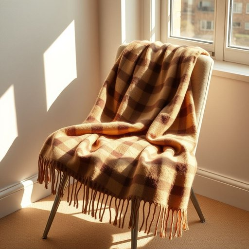

# scarf

<h1 style="font-size: 2.5em; font-weight: 300; letter-spacing: 2px; margin: 0; color: #2c3e50;">
/skɑrf/
</h1>

---

---

## 例句

Could you please hand me the scarf that’s draped over the armchair by the window, the one with the intricate tartan pattern and soft woolen texture, since I need something warm yet stylish to wear when I step outside for a quick walk this chilly afternoon?

*Could(/kʊd/) you(/ju/) please(/pliz/) hand(/hænd/) me(/mi/) the(/ðə/) scarf(/skɑrf/) that’s(/that’s*/) draped(/dreɪpt/) over(/ˈoʊvər/) the(/ðə/) armchair(/ˈɑrmˌʧɛr/) by(/baɪ/) the(/ðə/) window,(/ˈwɪndoʊ,/) the(/ðə/) one(/wən/) with(/wɪθ/) the(/ðə/) intricate(/ˈɪntrəkət/) tartan(/ˈtɑrtən/) pattern(/ˈpætərn/) and(/ənd/) soft(/sɔft/) woolen(/ˈwʊlən/) texture,(/ˈtɛksʧər,/) since(/sɪns/) I(/aɪ/) need(/nid/) something(/ˈsəmθɪŋ/) warm(/wɔrm/) yet(/jɛt/) stylish(/ˈstaɪlɪʃ/) to(/tɪ/) wear(/wɛr/) when(/wɪn/) I(/aɪ/) step(/stɛp/) outside(/ˈaʊtˈsaɪd/) for(/fər/) a(/ə/) quick(/kwɪk/) walk(/wɔk/) this(/ðɪs/) chilly(/ˈʧɪli/) afternoon?(/ˌæftərˈnun?/)*

**翻译：** 请帮我拿一下窗边扶手椅上那条围巾，就是那条带有复杂格子花纹、质地柔软的羊毛围巾，因为今天下午天气有些冷，我出门散步时需要既保暖又时尚的衣物。

---

## 解释

英语单词“scarf”作为名词，在家居生活用品的语境中主要指围巾，一种通常用软织物制成的长条状配饰，常用于保护颈部免受寒冷或作为装饰。具体使用场合包括冬季保暖、室内休闲时搭配服装或作为家中衣柜、衣帽间中的常见服饰配件。英语学习者在使用“scarf”时应注意其单复数形式复数为“scarves”，这是一个不规则复数，避免简单加“s”而误用为“scarfs”；此外，“scarf”作为动词还可表示“狼吞虎咽”，与名词意义不同。常见搭配有“wool scarf”指羊毛围巾、“silk scarf”指丝质围巾、“wear a scarf”表示戴围巾、“tie a scarf”表示系围巾等。词源上，“scarf”源自中世纪法语“escarpe”，意为绑带或绑布，进一步追溯到拉丁语“scarpa”，暗示围巾最初是作为包裹、保护身体的布料出现。在中文语境中，“scarf”准确对应“围巾”，不仅是保暖用品，也有时作为时尚配饰出现，常见于秋冬季节，文化上无褒贬含义，但在一些情况下，围巾作为礼物可能传递温馨或关怀的意味，总的来说为中性词汇，表达清晰直接。

---

<small style="color: #999; font-size: 0.9em;">2025-07-17 06:22:40</small>

