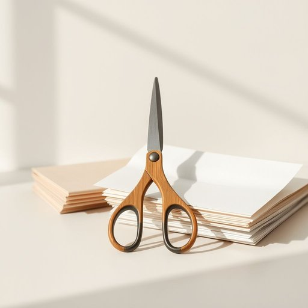

# scissors

<h1 style="font-size: 2.5em; font-weight: 300; letter-spacing: 2px; margin: 0; color: #2c3e50;">
/ˈsɪzərz/
</h1>

---

---

## 例句

Could you please hand me the scissors from the kitchen counter near the unopened mail so I can cut open this package before starting dinner?

*Could(/kʊd/) you(/ju/) please(/pliz/) hand(/hænd/) me(/mi/) the(/ðə/) scissors(/ˈsɪzərz/) from(/frəm/) the(/ðə/) kitchen(/ˈkɪʧən/) counter(/ˈkaʊntər/) near(/nɪr/) the(/ðə/) unopened(/əˈnoʊpənd/) mail(/meɪl/) so(/soʊ/) I(/aɪ/) can(/kən/) cut(/kət/) open(/ˈoʊpən/) this(/ðɪs/) package(/ˈpækɪʤ/) before(/ˌbiˈfɔr/) starting(/ˈstɑrtɪŋ/) dinner?(/ˈdɪnər?/)*

**翻译：** 您能帮我拿一下厨房台面上靠近未拆邮件的剪刀吗？我想用它把这个包裹打开，然后准备晚饭。

---

## 解释

英语单词“scissors”在家居生活用品的语境中作为名词，指的是一种由两个连接的金属刀片组成、用于剪切纸张、布料或其他材料的工具，通常用于家庭、办公室、学校等日常环境。具体使用场合包括剪裁手工材料、修剪布料、开包裹等情境，表达时常见搭配有“一把剪刀”（a pair of scissors），“用剪刀剪”（use scissors to cut），需要注意的是“scissors”是复数形式，通常不单独用单数形式“scissor”表示一把剪刀，因此使用时必须配合短语“一把”来表示单数；此外，“scissors”作名词时不可数，表示工具名称时始终复数，句子中谓语动词一般也用复数，如“The scissors are on the table.”；同时，词汇使用时要避免拼写误写成“scissor”，除非作为动词（表示剪裁行为）。该词源自拉丁语“scissor”，意为“切割者”，通过中古法语“cisoires”传入英语，自古即有剪切工具的含义。在中文语境中，“scissors”准确翻译为“剪刀”，指家庭生活中常见的剪切工具，强调其双刃、双手操作的特点，没有特殊的褒贬含义或文化色彩，仅在部分俚语或口语表达中可引申为比喻切断、分离的动作。

---

<small style="color: #999; font-size: 0.9em;">2025-07-17 06:22:40</small>

