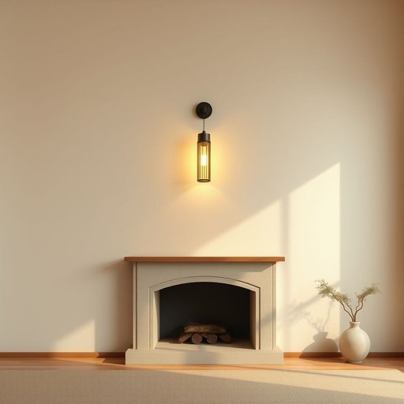

# sconce

<h1 style="font-size: 2.5em; font-weight: 300; letter-spacing: 2px; margin: 0; color: #2c3e50;">
/skɑns/
</h1>

---

---

## 例句

In the grand library of the centuries-old mansion, the intricate tapestry hanging above the fireplace, woven with threads of gold and crimson, narrated the forgotten history of the kingdom’s rise and fall, captivating every visitor who appreciated the rich symbolism embedded in the fabric.

*In(/ɪn/) the(/ðə/) grand(/grænd/) library(/ˈlaɪbrɛˌri/) of(/əv/) the(/ðə/) centuries-old(/centuries-old*/) mansion,(/ˈmænʃən,/) the(/ðə/) intricate(/ˈɪntrəkət/) tapestry(/ˈtæpəstri/) hanging(/ˈhæŋɪŋ/) above(/əˈbəv/) the(/ðə/) fireplace,(/ˈfaɪərˌpleɪs,/) woven(/ˈwoʊvən/) with(/wɪθ/) threads(/θrɛdz/) of(/əv/) gold(/goʊld/) and(/ənd/) crimson,(/ˈkrɪmzən,/) narrated(/ˈnɛˌreɪtɪd/) the(/ðə/) forgotten(/fərˈgɑtən/) history(/ˈhɪstəri/) of(/əv/) the(/ðə/) kingdom’s(/kingdom’s*/) rise(/raɪz/) and(/ənd/) fall,(/fɔl,/) captivating(/ˈkæptɪˌveɪtɪŋ/) every(/ˈɛvəri/) visitor(/ˈvɪzɪtər/) who(/hu/) appreciated(/əˈpriʃiˌeɪtɪd/) the(/ðə/) rich(/rɪʧ/) symbolism(/ˈsɪmbəˌlɪzəm/) embedded(/ɛmˈbɛdɪd/) in(/ɪn/) the(/ðə/) fabric.(/ˈfæbrɪk./)*

**翻译：** 在这座百年古宅的宏伟图书馆里，壁炉上方悬挂的精美挂毯以金线和绯红线编织而成，讲述着王国兴衰的尘封历史，吸引着每一位懂得欣赏其丰富象征意义的访客。

---

## 解释

英语单词‘sconce’作为名词，在家居生活用品的语境中指的是一种固定在墙上的灯具，通常是壁灯或壁式烛台，用以提供局部照明或装饰。具体使用场合多见于家庭客厅、走廊、卧室或公共场所的墙壁上，既能提升空间的美观度，也能满足照明需求。英语学习者在使用‘sconce’时需注意它通常作可数名词，常见的搭配有“wall sconce”（壁灯）、“candle sconce”（烛台壁灯）等，且用法多限于复数或单数形式直接指具体的壁灯实体，而不用于泛指灯光或照明装置；此外，作名词时一般不加冠词时可指类别，加冠词时则指特定的一盏或几盏。词源上，‘sconce’源自中古英语，最初意为防护工事或避难所，来自古法语‘sconce’意为遮蔽物，进而引申为保护墙壁上的灯具，以避免火焰被风吹灭，这种历史背景解释了该词与壁灯固定装置之间的联系。在中文语境中，‘sconce’准确翻译为“壁灯”或“壁式烛台”，强调其固定在墙面上的特性和装饰功能，适用于描述欧式或古典风格的家居照明设备。该词本身不带褒贬色彩，但由于常见于古典或复古家居环境，因此在文化上通常与优雅、传统或庄重的氛围相关联，学习者在使用时应结合具体语境避免生搬硬套。

---

<small style="color: #999; font-size: 0.9em;">2025-07-17 06:22:40</small>

