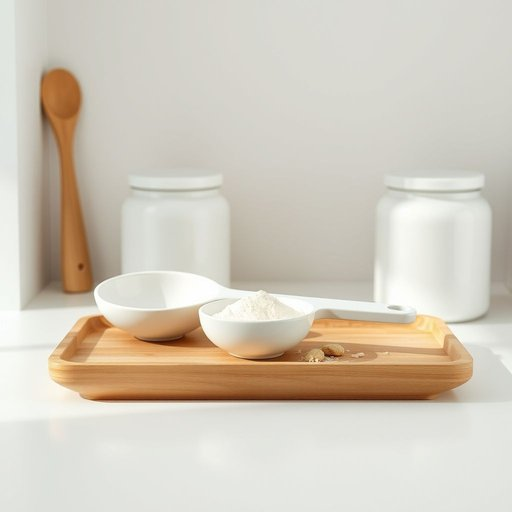

# scoop

<h1 style="font-size: 2.5em; font-weight: 300; letter-spacing: 2px; margin: 0; color: #2c3e50;">
/skup/
</h1>

---

---

## 例句

Could you please pass me the large scoop that we keep in the pantry next to the cookie jar, as I need to measure out exactly two scoops of flour for the cake recipe, which requires precise quantities to ensure it rises properly?

*Could(/kʊd/) you(/ju/) please(/pliz/) pass(/pæs/) me(/mi/) the(/ðə/) large(/lɑrʤ/) scoop(/skup/) that(/ðət/) we(/wi/) keep(/kip/) in(/ɪn/) the(/ðə/) pantry(/ˈpæntri/) next(/nɛkst/) to(/tɪ/) the(/ðə/) cookie(/ˈkʊki/) jar,(/ʤɑr,/) as(/ɛz/) I(/aɪ/) need(/nid/) to(/tɪ/) measure(/ˈmɛʒər/) out(/aʊt/) exactly(/ɪgˈzæktli/) two(/tu/) scoops(/skups/) of(/əv/) flour(/flaʊər/) for(/fər/) the(/ðə/) cake(/keɪk/) recipe,(/ˈrɛsəpi,/) which(/wɪʧ/) requires(/rikˈwaɪərz/) precise(/prɪˈsaɪs/) quantities(/kˈwɑntətiz/) to(/tɪ/) ensure(/ɪnˈʃʊr/) it(/ɪt/) rises(/ˈraɪzɪz/) properly?(/ˈprɑpərli?/)*

**翻译：** 请你把我们储藏室里放在饼干罐旁的大量勺递给我好吗？我需要准确量取两个勺子的面粉，以保证蛋糕配方的用量精准，使其能够充分膨胀。

---

## 解释

英语单词scoop作为名词在家居生活用品的语境中，通常指用于取量或舀取物品的小铲子或勺子，常见于厨房、储物罐或宠物食品桶中，比如用来舀咖啡粉、面粉、米粒或宠物粮。具体使用场合多为日常烹饪、食物分装或清洁时。英语学习者需要注意，scoop作名词时通常是可数名词，可以用复数形式scoops，且常与介词of连用来表达“一勺”的量，如a scoop of flour；此外，常见搭配有ice cream scoop（冰淇淋勺）或coffee scoop（咖啡勺），这有助于准确表达所指的具体工具。在语法上，scoop作为名词时可以作主语、宾语或定语使用，学习者应避免将其与动词scoop混淆。词源方面，scoop来源于中古英语scoep，最早源自古诺尔斯语skopa，意指舀取或挖掘的工具，反映了其功能性和形象化的起源。中文语境中，scoop一般翻译为勺子、瓢或小铲子，具体译法视用途而定，如冰淇淋用冰淇淋勺，宠物食物用小铲子或挖勺，强调其为用于舀取固体或颗粒物的工具，不含贬义，语义中性且功能明确。没有特定的文化色彩，但在描述家庭厨房用品时使用频率较高，体现实用性与便利性的家庭日常用具特征。

---

<small style="color: #999; font-size: 0.9em;">2025-07-17 06:22:40</small>

