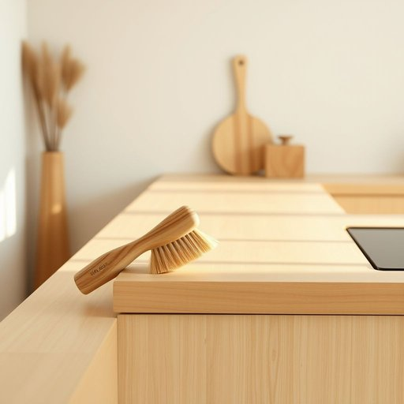

# scourer

<h1 style="font-size: 2.5em; font-weight: 300; letter-spacing: 2px; margin: 0; color: #2c3e50;">
/scourer*/
</h1>

---

---

## 例句

Before you start scrubbing the oven racks, make sure you have a reliable scourer on hand, preferably one that’s both abrasive enough to tackle baked-on grease and gentle enough not to scratch the delicate surfaces, because using the wrong type could do more harm than good.

*Before(/ˌbiˈfɔr/) you(/ju/) start(/stɑrt/) scrubbing(/ˈskrəbɪŋ/) the(/ðə/) oven(/ˈəvən/) racks,(/ræks,/) make(/meɪk/) sure(/ʃʊr/) you(/ju/) have(/hæv/) a(/ə/) reliable(/rɪˈlaɪəbəl/) scourer(/scourer*/) on(/ɔn/) hand,(/hænd,/) preferably(/ˈprɛfərəbli/) one(/wən/) that’s(/that’s*/) both(/boʊθ/) abrasive(/əˈbreɪsɪv/) enough(/ɪˈnəf/) to(/tɪ/) tackle(/ˈtækəl/) baked-on(/baked-on*/) grease(/gris/) and(/ənd/) gentle(/ˈʤɛnəl/) enough(/ɪˈnəf/) not(/nɑt/) to(/tɪ/) scratch(/skræʧ/) the(/ðə/) delicate(/ˈdɛləkət/) surfaces,(/ˈsərfəsɪz,/) because(/bɪˈkəz/) using(/ˈjuzɪŋ/) the(/ðə/) wrong(/rɔŋ/) type(/taɪp/) could(/kʊd/) do(/du/) more(/mɔr/) harm(/hɑrm/) than(/ðən/) good.(/gʊd./)*

**翻译：** 在开始擦洗烤箱托架之前，确保准备好一款可靠的清洁刷，最好既有足够的研磨力以去除顽固油渍，又足够温和以免刮伤精细表面，因为使用不当的清洁工具可能会得不偿失。

---

## 解释

英语单词“scourer”在家居生活用品场景中作为名词，通常指用于擦洗、清洁锅碗瓢盆、厨房台面等表面的磨砂清洁工具，如钢丝球、擦锅刷或磨砂海绵等。这类物品因具有较强的去污能力，适合清除顽固油渍和污垢，常见于厨房清洁语境中。英语学习者使用“scourer”时应注意，其作为可数名词，可以用复数形式“scourers”，且常与动词“use”、“buy”、“need”等连用，常见搭配如“steel scourer”（钢丝球）、“dish scourer”（洗碗擦）等。表达时应避免将其误用为动词“scour”（擦洗、冲刷）的名词形式，“scourer”专指物品。词源方面，“scourer”来源于动词“scour”，其本意是擦洗、冲刷，后加名词后缀“-er”表示执行该动作的工具或人，此词起源于中古英语，带有清洁擦洗的含义。中文语境中，“scourer”准确翻译多为“磨砂擦”、“钢丝球”或“擦锅器”，根据材质和形态具体选择，体现其实用性和清洁功能。在使用时该词无明显褒贬含义，但因带有较强的磨砂性质，不宜用于描述易损表面清洁，属于中性且功能性很强的家居清洁用具名词。

---

<small style="color: #999; font-size: 0.9em;">2025-07-17 06:22:40</small>

