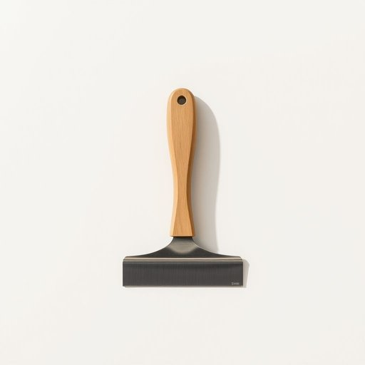

# scraper

<h1 style="font-size: 2.5em; font-weight: 300; letter-spacing: 2px; margin: 0; color: #2c3e50;">
/ˈskreɪpər/
</h1>

---

---

## 例句

Before we repaint the kitchen walls, could you please hand me the scraper that’s in the drawer next to the window, the one with the slightly chipped handle and the flexible metal blade that’s perfect for removing old wallpaper and stubborn paint residues?

*Before(/ˌbiˈfɔr/) we(/wi/) repaint(/riˈpeɪnt/) the(/ðə/) kitchen(/ˈkɪʧən/) walls,(/wɔlz,/) could(/kʊd/) you(/ju/) please(/pliz/) hand(/hænd/) me(/mi/) the(/ðə/) scraper(/ˈskreɪpər/) that’s(/that’s*/) in(/ɪn/) the(/ðə/) drawer(/drɔr/) next(/nɛkst/) to(/tɪ/) the(/ðə/) window,(/ˈwɪndoʊ,/) the(/ðə/) one(/wən/) with(/wɪθ/) the(/ðə/) slightly(/sˈlaɪtli/) chipped(/ʧɪpt/) handle(/ˈhændəl/) and(/ənd/) the(/ðə/) flexible(/ˈflɛksəbəl/) metal(/ˈmɛtəl/) blade(/bleɪd/) that’s(/that’s*/) perfect(/ˈpərˌfɪkt/) for(/fər/) removing(/riˈmuvɪŋ/) old(/oʊld/) wallpaper(/ˈwɔlˌpeɪpər/) and(/ənd/) stubborn(/ˈstəbərn/) paint(/peɪnt/) residues?(/ˈrɛzəˌduz?/)*

**翻译：** 在我们重新粉刷厨房墙壁之前，能请你把窗边抽屉里的刮刀递给我吗？就是那个柄部略有缺口、带有柔韧金属刃片，非常适合清除旧墙纸和顽固油漆残留的那把。

---

## 解释

英语单词“scraper”在家居生活用品语境中作为名词，通常指用于刮除或清理表面物质的工具，如厨房用的刮刀、刮皮器或者清洁时刮除污渍的刮板等。具体使用场合多见于厨房、卫生间或清洁场景，例如用scraper刮去锅底焦渍、刮掉冰箱里的结霜，或刮洗地板上的污泥。英语学习者在使用该词时应注意其可数名词性质，常见搭配有“paint scraper”（油漆刮刀）、“ice scraper”（除冰器）、“dough scraper”（擀面刮板）等，表达时常与表示材质或用途的名词连用，以明确工具功能；此外，scraper的复数形式为scrapers。在语法上，scraper多指实体工具，不宜用于抽象意义。词源方面，“scraper”源自动词“scrape”，意为“刮、擦”，加上表示执行者或工具的后缀“-er”，整体寓意“用来刮的工具”，体现其功能属性。中文语境中，“scraper”准确翻译为“刮刀”、“刮板”或“刮器”，具体翻译需结合实际工具的用途和形态。该词本身无明显褒贬或特殊文化内涵，属于中性日常用语，但在某些行业及场合因工具材质和形状不同，名称和用途可能稍有变化。理解时应结合场景，否则可能与建筑业中的“高楼大厦”（skyscraper）混淆。综上，“scraper”在家居生活中是指用于刮擦、清除的实用工具，强调其物理功能，应根据上下文准确选词使用。

---

<small style="color: #999; font-size: 0.9em;">2025-07-17 06:22:40</small>

