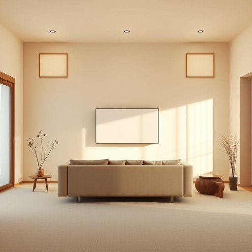

# screen

<h1 style="font-size: 2.5em; font-weight: 300; letter-spacing: 2px; margin: 0; color: #2c3e50;">
/skrin/
</h1>

---

---

## 例句

Could you please adjust the brightness and angle of the TV screen in the living room so that it is easier to watch from the sofa without any glare from the window, especially during the afternoon when the sunlight is strongest?

*Could(/kʊd/) you(/ju/) please(/pliz/) adjust(/əˈʤəst/) the(/ðə/) brightness(/ˈbraɪtnəs/) and(/ənd/) angle(/ˈæŋgəl/) of(/əv/) the(/ðə/) TV(/ˌtɛləˈvɪʒən/) screen(/skrin/) in(/ɪn/) the(/ðə/) living(/ˈlɪvɪŋ/) room(/rum/) so(/soʊ/) that(/ðət/) it(/ɪt/) is(/ɪz/) easier(/ˈiziər/) to(/tɪ/) watch(/wɔʧ/) from(/frəm/) the(/ðə/) sofa(/ˈsoʊfə/) without(/wɪˈθaʊt/) any(/ˈɛni/) glare(/glɛr/) from(/frəm/) the(/ðə/) window,(/ˈwɪndoʊ,/) especially(/əˈspɛʃəli/) during(/ˈdʊrɪŋ/) the(/ðə/) afternoon(/ˌæftərˈnun/) when(/wɪn/) the(/ðə/) sunlight(/ˈsənˌlaɪt/) is(/ɪz/) strongest?(/ˈstrɔŋgəst?/)*

**翻译：** 请您调整客厅电视屏幕的亮度和角度，使从沙发观看时更加舒适，尤其是在下午阳光最强烈时，避免窗户反光影响观看体验。

---

## 解释

英语单词“screen”作为名词在家居生活用品的语境中，常指用于隔断、遮挡或保护的各种屏风、纱窗、幕布或显示屏。具体使用场合例如客厅中的折叠屏风用来分隔空间，窗户上的纱网屏用以防蚊虫，或者电视、电脑的显示屏等。学习者在使用该词时应注意其可数多义特点，screen既指具体的物理物件，也可泛指电子显示设备，因此在搭配上常见的有“a window screen”（窗户纱窗）、“a folding screen”（折叠屏风）、“a TV screen”（电视屏幕）、“a computer screen”（电脑屏幕）等。此外，screen还常与动词连用构成动名词结构如“screen door”（纱门），表示特定用品。词源上，screen源自中古英语“screne”，意为帘子、障板，最早来自古法语“escren”，即保护、遮挡之意，反映了其本质是隔断或遮蔽的功能。中文语境中，“screen”根据具体物品的不同可译为“屏风”、“纱窗”、“幕布”或“屏幕”，译法需结合具体的生活用品环境，否则容易混淆。总体而言，screen在家居生活用品中通常无褒贬色彩，属于中性词汇，但在某些情况下如电子产品领域，它也隐含了技术现代化的文化内涵。使用时注意根据具体上下文选取合适翻译，避免泛化或误用。

---

<small style="color: #999; font-size: 0.9em;">2025-07-17 06:22:40</small>

