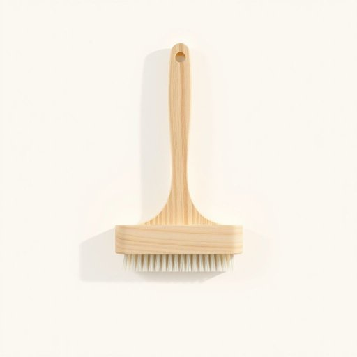

# scrubber

<h1 style="font-size: 2.5em; font-weight: 300; letter-spacing: 2px; margin: 0; color: #2c3e50;">
/ˈskrəbər/
</h1>

---

---

## 例句

I couldn’t find the scrubber we usually use to clean the stubborn stains on the kitchen tiles, the one with the ergonomic handle and the replaceable bristles, so I had to make do with a sponge, although it didn’t work nearly as well.

*I(/aɪ/) couldn’t(/couldn’t*/) find(/faɪnd/) the(/ðə/) scrubber(/ˈskrəbər/) we(/wi/) usually(/ˈjuʒəwəli/) use(/juz/) to(/tɪ/) clean(/klin/) the(/ðə/) stubborn(/ˈstəbərn/) stains(/steɪnz/) on(/ɔn/) the(/ðə/) kitchen(/ˈkɪʧən/) tiles,(/taɪlz,/) the(/ðə/) one(/wən/) with(/wɪθ/) the(/ðə/) ergonomic(/ˌərgəˈnɑmɪk/) handle(/ˈhændəl/) and(/ənd/) the(/ðə/) replaceable(/ˌriˈpleɪsəbəl/) bristles,(/ˈbrɪsəlz,/) so(/soʊ/) I(/aɪ/) had(/hæd/) to(/tɪ/) make(/meɪk/) do(/du/) with(/wɪθ/) a(/ə/) sponge,(/spənʤ,/) although(/ˌɔlˈðoʊ/) it(/ɪt/) didn’t(/didn’t*/) work(/wərk/) nearly(/ˈnɪrli/) as(/ɛz/) well.(/wɛl./)*

**翻译：** 我找不到我们平时用来清洁厨房瓷砖顽固污渍的刷子，那种带符合人体工学手柄且刷毛可替换的，只好将就用海绵，虽然效果远不如刷子。

---

## 解释

“scrubber”作为名词，在家居生活用品语境中通常指用于清洁表面物体的刷子或擦洗工具，尤其是用于洗碗、清洁锅具、去除顽固污渍的刷子或海绵。具体使用场合多见于厨房清洁、浴室清理等场景，如“dish scrubber”（洗碗刷）、“floor scrubber”（地板刷）。英语学习者使用时应注意“scrubber”是可数名词，常用复数形式“scrubbers”，且常与表示洁净对象或部位的名词搭配，如“scrubber for pots”（锅刷）、“scrubber pad”（擦洗垫）。此外，与动词“scrub”（擦洗）相关，“scrubber”作为工具名词，体现了功能属性。其词源源自动词“scrub”，意即擦洗或刷洗，加上名词后缀“-er”表示执行该动作的工具或人，因此“scrubber”即指“用来擦洗的东西”。在中文语境中，准确翻译为“刷子”、“擦洗器”或“擦洗垫”，具体可根据材质和用途不同而有所细分，但总体指涉功能性强的家用清洁工具。该词本身无褒贬色彩，属于中性词汇，在文化层面主要体现对家庭清洁工具的实用关注。

---

<small style="color: #999; font-size: 0.9em;">2025-07-17 06:22:40</small>

