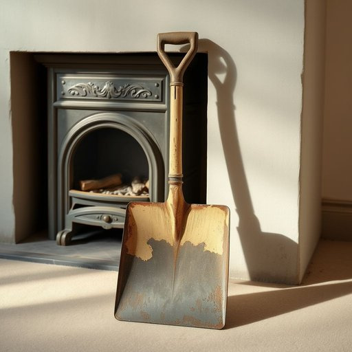

# scuttle

<h1 style="font-size: 2.5em; font-weight: 300; letter-spacing: 2px; margin: 0; color: #2c3e50;">
/ˈskətəl/
</h1>

---

---

## 例句

Could you please bring me the old scuttle from the shed, the one with the chipped paint and the rusty handle, so I can fill it with coal before lighting the fire in the living room, as it's much easier than carrying smaller buckets back and forth?

*Could(/kʊd/) you(/ju/) please(/pliz/) bring(/brɪŋ/) me(/mi/) the(/ðə/) old(/oʊld/) scuttle(/ˈskətəl/) from(/frəm/) the(/ðə/) shed,(/ʃɛd,/) the(/ðə/) one(/wən/) with(/wɪθ/) the(/ðə/) chipped(/ʧɪpt/) paint(/peɪnt/) and(/ənd/) the(/ðə/) rusty(/ˈrəsti/) handle,(/ˈhændəl,/) so(/soʊ/) I(/aɪ/) can(/kən/) fill(/fɪl/) it(/ɪt/) with(/wɪθ/) coal(/koʊl/) before(/ˌbiˈfɔr/) lighting(/ˈlaɪtɪŋ/) the(/ðə/) fire(/faɪər/) in(/ɪn/) the(/ðə/) living(/ˈlɪvɪŋ/) room,(/rum,/) as(/ɛz/) it's(/ɪts/) much(/məʧ/) easier(/ˈiziər/) than(/ðən/) carrying(/ˈkɛriɪŋ/) smaller(/sˈmɔlər/) buckets(/ˈbəkəts/) back(/bæk/) and(/ənd/) forth?(/fɔrθ?/)*

**翻译：** 请你把库房里那个旧煤桶拿过来，就是那个油漆剥落、手柄生锈的，我好在点燃客厅的火炉前往里面装煤，这样比来回搬运小桶要方便得多。

---

## 解释

英语单词“scuttle”作为名词，在家居生活用品的语境中，通常指一种有盖的桶或小桶，特别用于盛放煤炭或木屑，方便搬运和储存。这种容器多见于传统英国家庭，尤其是使用煤炉或壁炉的场合，用于保持煤炭或燃料的干燥和整洁，常置于炉边或壁炉旁。英语学习者在使用“scuttle”作为名词时，应注意其单复数形式（复数为“scuttles”），且常与具体名词搭配，如“coal scuttle”（煤炭桶）、“ash scuttle”（灰桶）等。此外，“scuttle”在作为名词时通常指具体可见的物品，与其动词含义“急跑”或“毁坏”无混淆，语境判断较为重要。词源上，“scuttle”源自中古英语“scutel”，继承自拉丁语“scutella”，意为小盘或小碟，逐渐引申为小桶或容器，此词根与盛放的物品形态有关。在中文语境中，“scuttle”作为家居用品名词最佳翻译为“（带盖的）煤桶”或“煤炭桶”，强调其储煤和便于搬运的功能；若指灰烬则可译为“灰桶”。这一词汇不含褒义或贬义色彩，属于物品名称，文化上体现了传统英国家庭燃料储存的生活习惯，现代家庭中因燃料使用方式变化较少见，一般在描写古典或乡村生活时出现较多。

---

<small style="color: #999; font-size: 0.9em;">2025-07-17 06:22:40</small>

