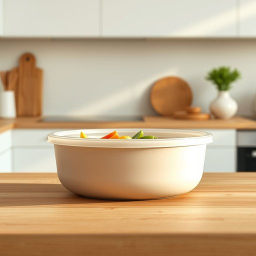

# seal

<h1 style="font-size: 2.5em; font-weight: 300; letter-spacing: 2px; margin: 0; color: #2c3e50;">
/sil/
</h1>

---

---

## 例句

Before you put the leftovers in the fridge, make sure the seal on the container is completely intact, because if the seal is broken or loose, it could cause the food to spoil faster due to exposure to air and moisture.

*Before(/ˌbiˈfɔr/) you(/ju/) put(/pʊt/) the(/ðə/) leftovers(/ˈlɛfˌtoʊvərz/) in(/ɪn/) the(/ðə/) fridge,(/frɪʤ,/) make(/meɪk/) sure(/ʃʊr/) the(/ðə/) seal(/sil/) on(/ɔn/) the(/ðə/) container(/kənˈteɪnər/) is(/ɪz/) completely(/kəmˈplitli/) intact,(/ˌɪnˈtækt,/) because(/bɪˈkəz/) if(/ɪf/) the(/ðə/) seal(/sil/) is(/ɪz/) broken(/ˈbroʊkən/) or(/ər/) loose,(/lus,/) it(/ɪt/) could(/kʊd/) cause(/kɔz/) the(/ðə/) food(/fud/) to(/tɪ/) spoil(/spɔɪl/) faster(/ˈfæstər/) due(/du/) to(/tɪ/) exposure(/ɪkˈspoʊʒər/) to(/tɪ/) air(/ɛr/) and(/ənd/) moisture.(/ˈmɔɪsʧər./)*

**翻译：** 在把剩饭剩菜放进冰箱之前，一定要确保容器的封口完好无损，因为如果封口破损或松动，食物暴露在空气和湿气中会更容易变质。

---

## 解释

英语单词“seal”作为名词在家居生活用品语境中，通常指用于密封容器或接口的装置或材料，例如瓶盖上的密封圈、防水胶条或门窗的密封条，用于防止空气、水分、灰尘等进入，保持物品的新鲜及环境的干净。具体使用场合多见于描述保持食物新鲜的保鲜盒密封垫、防止水渗漏的浴室门密封条、窗户的隔音防风密封等。英语学习者在使用“seal”时应注意其可数与不可数用法，作为名词时通常为可数名词，如a seal，指具体的一个密封装置；也有时泛指密封材料或功能时表现为总体概念，视语境而定。此外，“seal”常与动词“to create/make a seal”（制造密封）搭配，或者用“seal”作为整体设施如“door seal”、“window seal”等短语。词源上，“seal”来自中古英语，源于拉丁语“sigillum”，意指盖印、封印，原指印章，后引申为“密封物”，体现了“封闭、隔断”这一核心含义。在中文语境中，“seal”作为家居生活用品名词应准确翻译为“密封装置”、“密封圈”、“密封条”等，强调其功能性和实物属性，避免与“海豹”等同音词混淆。该词本身带有中性语气，无褒贬含义，但因功能性重要，常用于强调产品质量和性能，是描述居家用品密封效果时的重要术语。

---

<small style="color: #999; font-size: 0.9em;">2025-07-17 06:22:40</small>

