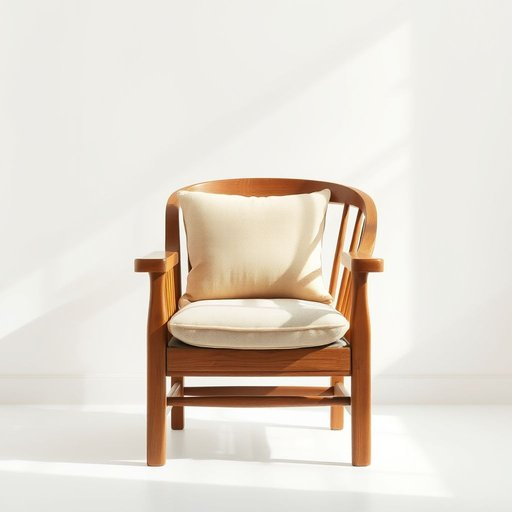

# seat

<h1 style="font-size: 2.5em; font-weight: 300; letter-spacing: 2px; margin: 0; color: #2c3e50;">
/sit/
</h1>

---

---

## 例句

Could you please move that cushion off the antique armchair so I can check if the seat, which often creaks under weight due to its delicate wooden frame and worn upholstery, needs repairing before our guests arrive this evening?

*Could(/kʊd/) you(/ju/) please(/pliz/) move(/muv/) that(/ðət/) cushion(/ˈkʊʃən/) off(/ɔf/) the(/ðə/) antique(/ænˈtik/) armchair(/ˈɑrmˌʧɛr/) so(/soʊ/) I(/aɪ/) can(/kən/) check(/ʧɛk/) if(/ɪf/) the(/ðə/) seat,(/sit,/) which(/wɪʧ/) often(/ˈɔfən/) creaks(/creaks*/) under(/ˈəndər/) weight(/weɪt/) due(/du/) to(/tɪ/) its(/ɪts/) delicate(/ˈdɛləkət/) wooden(/ˈwʊdən/) frame(/freɪm/) and(/ənd/) worn(/wɔrn/) upholstery,(/əˈpoʊlstəri,/) needs(/nidz/) repairing(/rɪˈpɛrɪŋ/) before(/ˌbiˈfɔr/) our(/ɑr/) guests(/gɛsts/) arrive(/əraɪv/) this(/ðɪs/) evening?(/ˈivnɪŋ?/)*

**翻译：** 请您把那只垫子从古董扶手椅上挪开，好让我检查一下座位是否需要修理——这把椅子的木质框架精致且包布已磨损，承重时常会吱吱作响——以备今晚客人来访之前处理。

---

## 解释

英语单词'seat'在家居生活用品语境中作为名词，主要指人坐的地方或坐具，如椅子、凳子、沙发上的坐垫等，使用场合通常涉及描述家具中供坐的部分或座位，例如在客厅中提到sofa seat（沙发座位），或谈论餐桌旁的chair seat（椅子座位）。英语学习者在使用'seat'作名词时应注意其不用于指整件家具，仅指供坐的部分或座位位置，如“take a seat”（请坐）中的"seat"泛指一个座位而非特定家具，同时常见搭配包括“seat cushion”（座垫）、“seat cover”（座套）、“car seat”（汽车座椅）等，需注意与动词“seat”（使就座）区别。词源方面，'seat'来自古英语“setl”，意为固定的座位或坐处，反映了其作为坐具位置的传统功能。在中文语境中，“seat”翻译为“座位”“坐处”或“座椅的坐部分”较为准确，在家居中多指具体可坐的部位，区别于“椅子”整体，避免混淆。该词在家居领域通常中性无褒贬含义，文化内涵简单直观，强调提供坐着的功能性，属于日常生活用品的基本用词。

---

<small style="color: #999; font-size: 0.9em;">2025-07-17 06:22:40</small>

