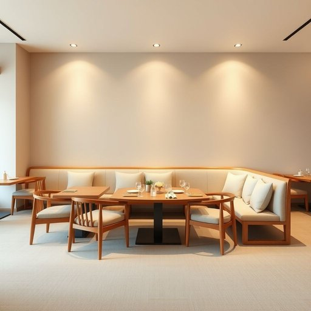

# seating

<h1 style="font-size: 2.5em; font-weight: 300; letter-spacing: 2px; margin: 0; color: #2c3e50;">
/ˈsitɪŋ/
</h1>

---

---

## 例句

The restaurant's seating arrangement was thoughtfully designed to accommodate both small, intimate dinners and larger groups, ensuring that every guest felt comfortable and had enough space to enjoy their meal.

*The(/ðə/) restaurant's(/ˈrɛˌstrɑnts/) seating(/ˈsitɪŋ/) arrangement(/ərˈeɪnʤmənt/) was(/wɑz/) thoughtfully(/ˈθɔtfəli/) designed(/dɪˈzaɪnd/) to(/tɪ/) accommodate(/əˈkɑməˌdeɪt/) both(/boʊθ/) small,(/smɔl,/) intimate(/ˈɪnɪmət/) dinners(/ˈdɪnərz/) and(/ənd/) larger(/ˈlɑrʤər/) groups,(/grups,/) ensuring(/ɪnˈʃʊrɪŋ/) that(/ðət/) every(/ˈɛvəri/) guest(/gɛst/) felt(/fɛlt/) comfortable(/ˈkəmfərtəbəl/) and(/ənd/) had(/hæd/) enough(/ɪˈnəf/) space(/speɪs/) to(/tɪ/) enjoy(/ˌɛnˈʤɔɪ/) their(/ðɛr/) meal.(/mil./)*

**翻译：** 餐厅的座位布局经过精心设计，既适合小型的亲密晚餐，也能容纳较大的团体，确保每位宾客都感到舒适，并拥有充足的空间享用美食。

---

## 解释

英语单词“seating”作为名词，在家居生活用品领域主要指的是供人坐的家具或整体座位的安排，常用于描述沙发、椅子或其他座椅的类型与布置。例如，在讨论客厅家具时，“seating”可以泛指各种座椅产品，强调坐的功能和舒适度。英语学习者在使用“seating”作为名词时需注意，其通常是不可数名词，用于表示整体座位布置或座椅总称，而非单个具体的椅子；若指单个座位，应使用“seat”。常见搭配包括“seating arrangement”（座位安排）、“seating capacity”（座位容量）和“seating area”（休息区），这些搭配有助于准确表达座位的空间布局和数量。词源方面，“seating”源自动词“seat”的现在分词形式，起初表示“使某人就坐”的动作，后来引申为“座位”的固定称呼，反映了从动作到状态的语义转变。在中文语境中，“seating”通常翻译为“座椅”“座位配置”或“坐具”，根据上下文具体指代座椅整体或座位布局，无贬义或褒义色彩，主要侧重实用功能和空间利用，符合家居生活中对舒适与安排的关注。

---

<small style="color: #999; font-size: 0.9em;">2025-07-17 06:22:40</small>

