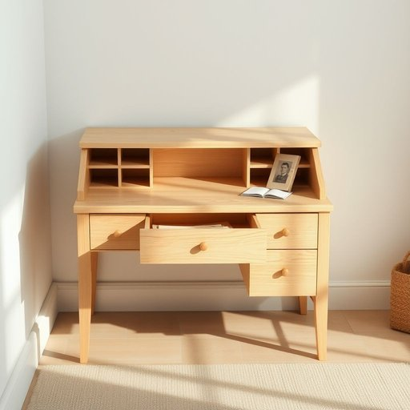

# secretary

<h1 style="font-size: 2.5em; font-weight: 300; letter-spacing: 2px; margin: 0; color: #2c3e50;">
/ˈsɛkrəˌtɛri/
</h1>

---

---

## 例句

After finally dusting off the old secretary in the corner of the living room, which had been tucked away behind a stack of magazines and various knick-knacks for years, she discovered a hidden drawer filled with letters and photographs that revealed long-forgotten family stories.

*After(/ˈæftər/) finally(/ˈfaɪnəli/) dusting(/ˈdəstɪŋ/) off(/ɔf/) the(/ðə/) old(/oʊld/) secretary(/ˈsɛkrəˌtɛri/) in(/ɪn/) the(/ðə/) corner(/ˈkɔrnər/) of(/əv/) the(/ðə/) living(/ˈlɪvɪŋ/) room,(/rum,/) which(/wɪʧ/) had(/hæd/) been(/bɪn/) tucked(/təkt/) away(/əˈweɪ/) behind(/bɪˈhaɪnd/) a(/ə/) stack(/stæk/) of(/əv/) magazines(/ˈmægəˌzinz/) and(/ənd/) various(/ˈvɛriəs/) knick-knacks(/ˈnɪkˈnæks/) for(/fər/) years,(/jɪrz,/) she(/ʃi/) discovered(/dɪˈskəvərd/) a(/ə/) hidden(/ˈhɪdən/) drawer(/drɔr/) filled(/fɪld/) with(/wɪθ/) letters(/ˈlɛtərz/) and(/ənd/) photographs(/ˈfoʊtəˌgræfs/) that(/ðət/) revealed(/rɪˈvild/) long-forgotten(/long-forgotten*/) family(/ˈfæməli/) stories.(/ˈstɔriz./)*

**翻译：** 经过长时间将客厅角落那台老旧的写字台掩藏在一堆杂志和各式小摆件之后，她终于将其清理出来，意外发现其中一个隐藏的抽屉里装满了信件和照片，揭示了许多早已被遗忘的家族故事。

---

## 解释

在家居生活用品的英语语境中，名词“secretary”通常指一种带有书桌和储物柜功能的家具，称为“写字台”或“秘书桌”，这是一种既能用作写作、办公又便于存放文件和文具的多功能家具，常见于家庭书房或办公区。英语学习者需要注意的是，当“secretary”用于表示家具时，通常与“desk”（如“secretary desk”）搭配使用，且其含义与表示职位的“秘书”不同，语境也通常会围绕家具布局或家居环境展开。在语法上，“secretary”作为家具名词时是可数名词，可以直接用作单数或复数形式（secretaries），但在家具语境中出现复数较少。词源方面，“secretary”源自拉丁文“secretarius”，意为“保密者、书记”，最初指掌管机密事务的人，后来其家具含义来源于这类人的办公桌，即专门用来存储重要文件和书写的写字台。中文语境中，“secretary”在家居生活用品场景精确翻译为“写字台”或“秘书桌”，一般不翻译为“秘书”，以避免混淆职业身份。该词在家具意义上没有褒贬色彩，属于中性词汇，但需区分其不同语境下的多义性，以免理解错误。在文化上，传统的“secretary desk”因其古典设计和功能性，常被看作一种典雅复古的家具，体现了复合功能与空间节约的设计智慧。

---

<small style="color: #999; font-size: 0.9em;">2025-07-17 06:22:40</small>

