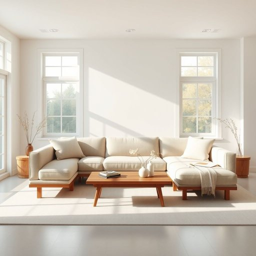

# sectional

<h1 style="font-size: 2.5em; font-weight: 300; letter-spacing: 2px; margin: 0; color: #2c3e50;">
/ˈsɛkʃənəl/
</h1>

---

---

## 例句

After debating for hours whether to opt for a traditional sofa or something more versatile, we finally agreed that purchasing a sectional would be ideal, as it not only provides ample seating for our frequent guests but also allows us to rearrange the living room effortlessly depending on the occasion or mood.

*After(/ˈæftər/) debating(/dəˈbeɪtɪŋ/) for(/fər/) hours(/aʊərz/) whether(/ˈwɛðər/) to(/tɪ/) opt(/ɑpt/) for(/fər/) a(/ə/) traditional(/trəˈdɪʃənəl/) sofa(/ˈsoʊfə/) or(/ər/) something(/ˈsəmθɪŋ/) more(/mɔr/) versatile,(/ˈvərsətəl,/) we(/wi/) finally(/ˈfaɪnəli/) agreed(/əˈgrid/) that(/ðət/) purchasing(/ˈpərʧəsɪŋ/) a(/ə/) sectional(/ˈsɛkʃənəl/) would(/wʊd/) be(/bi/) ideal,(/aɪˈdil,/) as(/ɛz/) it(/ɪt/) not(/nɑt/) only(/ˈoʊnli/) provides(/prəˈvaɪdz/) ample(/ˈæmpəl/) seating(/ˈsitɪŋ/) for(/fər/) our(/ɑr/) frequent(/ˈfrikˌwɛnt/) guests(/gɛsts/) but(/bət/) also(/ˈɔlsoʊ/) allows(/əˈlaʊz/) us(/ˈjuˈɛs/) to(/tɪ/) rearrange(/riəreɪnʤ/) the(/ðə/) living(/ˈlɪvɪŋ/) room(/rum/) effortlessly(/ˈɛfərtləsli/) depending(/dɪˈpɛndɪŋ/) on(/ɔn/) the(/ðə/) occasion(/əˈkeɪʒən/) or(/ər/) mood.(/mud./)*

**翻译：** 经过数小时的讨论，我们最终一致认为购买一套组合沙发是理想的选择，因为它不仅为我们的常客提供了充足的座位，还能让我们根据不同的场合或心情轻松地重新布置客厅。

---

## 解释

英语单词“sectional”作为名词在家居生活用品场景中主要指组合式沙发，即由多个可以分开或重新组合的部分组成的沙发，常见于客厅或休息区，使用时通常体现为灵活布置空间的家具选择。学习者在使用该词为名词时应注意其复数形式“sectionals”，且该词常搭配形容词如“comfortable sectional”（舒适的组合沙发）、“leather sectional”（皮质组合沙发）等表达，此外也可与“sofa”或“couch”互换使用，但“sectional”突出其模块化特点。词源上，“sectional”来自形容词“section”，意指“部分”或“段落”，组合而成表示“由多个部分组成的”，起源与家具设计中模块化结构有关。在中文语境中，“sectional”准确翻译为“组合沙发”或“分段沙发”，强调其由若干可拆分或拼接的模块组成的特点，无贬褒色彩，属于中性常用词，文化上反映现代家居追求灵活和多功能性的设计理念。

---

<small style="color: #999; font-size: 0.9em;">2025-07-17 06:22:40</small>

