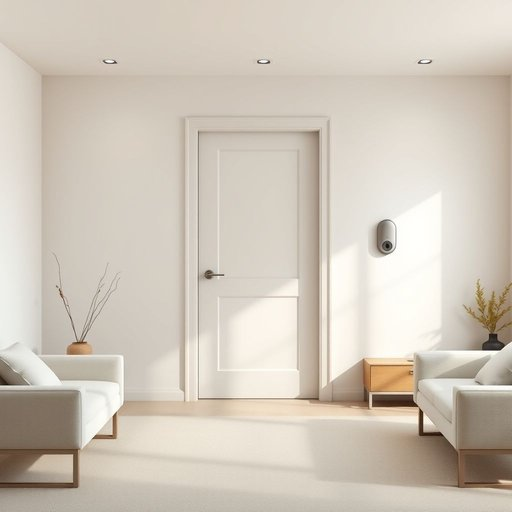

# security

<h1 style="font-size: 2.5em; font-weight: 300; letter-spacing: 2px; margin: 0; color: #2c3e50;">
/sɪˈkjʊrəti/
</h1>

---

---

## 例句

Given the recent increase in neighbourhood break-ins, installing a comprehensive security system, which includes motion sensors, CCTV cameras, and smart locks, has become an essential step not only to protect our home and valuables but also to provide peace of mind for everyone living under this roof.

*Given(/ˈgɪvɪn/) the(/ðə/) recent(/ˈrisənt/) increase(/ˌɪnˈkris/) in(/ɪn/) neighbourhood(/ˈneɪbərˌhʊd/) break-ins,(/break-ins*,/) installing(/ˌɪnˈstɔlɪŋ/) a(/ə/) comprehensive(/ˌkɑmpriˈhɛnsɪv/) security(/sɪˈkjʊrəti/) system,(/ˈsɪstəm,/) which(/wɪʧ/) includes(/ˌɪnˈkludz/) motion(/ˈmoʊʃən/) sensors,(/ˈsɛnsərz,/) CCTV(/ˈsiˌsiˈtiˌvi/) cameras,(/ˈkæmərəz,/) and(/ənd/) smart(/smɑrt/) locks,(/lɑks,/) has(/həz/) become(/bɪˈkəm/) an(/ən/) essential(/ɛˈsɛnʃəl/) step(/stɛp/) not(/nɑt/) only(/ˈoʊnli/) to(/tɪ/) protect(/prəˈtɛkt/) our(/ɑr/) home(/hoʊm/) and(/ənd/) valuables(/ˈvæljəbəlz/) but(/bət/) also(/ˈɔlsoʊ/) to(/tɪ/) provide(/prəˈvaɪd/) peace(/pis/) of(/əv/) mind(/maɪnd/) for(/fər/) everyone(/ˈɛvriˌwən/) living(/ˈlɪvɪŋ/) under(/ˈəndər/) this(/ðɪs/) roof.(/rʊf./)*

**翻译：** 鉴于近期小区入室盗窃事件的增多，安装一套包括移动传感器、闭路电视摄像头和智能锁在内的全面安全系统，已成为一项必不可少的措施，不仅能保护我们的家园和贵重财物，更能为每一位居住在此的人带来安心与宁静。

---

## 解释

英语单词“security”在家居生活用品场景中作为名词，主要指保护家庭成员和财产免受盗窃、入侵、火灾等危险的状态或措施，比如家庭安防系统、安全锁、报警设备等。具体使用场合通常涉及谈论家庭安全、监控设备、门窗保护系统等语境，例如“The security system in our home includes cameras and motion sensors”（我们家的安防系统包括摄像头和运动传感器）。学习者在使用“security”时应注意它是不可数名词，表示的是一种状态或整体概念，且常与介词短语搭配，如“security measures”（安全措施）、“security alarm”（安全警报）、“home security”（家庭安全）等；此外，“security”可用作形容词性复合词，如“security camera”、“security system”；语法上，“security”通常作为主语、宾语或表语出现。词源方面，“security”来自拉丁语“securitas”，意为“无忧无虑、安全”，由“se-”（无）和“cura”（关心、忧虑）组成，传达了无危险、放心的含义。在中文语境中，“security”常被精准翻译为“安全”或“安全保障”，在家居用品领域多指“安防”或“安保措施”，强调保护和防范的功能。需注意的是，“security”本身较为中性，通常无明显褒贬色彩，但根据具体上下文，有时涉及隐私保护问题时可能带有一定警惕或关注的文化内涵。综上，“security”在家居生活用品领域是一词多义且高频的核心词汇，表示围绕居家安全的各种保护状态和措施，是理解家庭安防相关话题的重要词汇。

---

<small style="color: #999; font-size: 0.9em;">2025-07-17 06:22:40</small>

