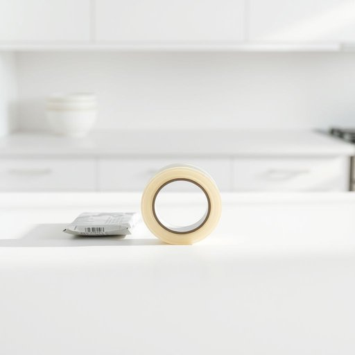

# sellotape

<h1 style="font-size: 2.5em; font-weight: 300; letter-spacing: 2px; margin: 0; color: #2c3e50;">
/sellotape*/
</h1>

---

---

## 例句

Could you please pass me the roll of sellotape that's on the kitchen counter next to the unopened parcel, since I need to secure the edges of this wrapping paper more firmly before the guests arrive this evening?

*Could(/kʊd/) you(/ju/) please(/pliz/) pass(/pæs/) me(/mi/) the(/ðə/) roll(/roʊl/) of(/əv/) sellotape(/sellotape*/) that's(/ðæts/) on(/ɔn/) the(/ðə/) kitchen(/ˈkɪʧən/) counter(/ˈkaʊntər/) next(/nɛkst/) to(/tɪ/) the(/ðə/) unopened(/əˈnoʊpənd/) parcel,(/ˈpɑrsəl,/) since(/sɪns/) I(/aɪ/) need(/nid/) to(/tɪ/) secure(/sɪˈkjʊr/) the(/ðə/) edges(/ˈɛʤɪz/) of(/əv/) this(/ðɪs/) wrapping(/ˈræpɪŋ/) paper(/ˈpeɪpər/) more(/mɔr/) firmly(/ˈfərmli/) before(/ˌbiˈfɔr/) the(/ðə/) guests(/gɛsts/) arrive(/əraɪv/) this(/ðɪs/) evening?(/ˈivnɪŋ?/)*

**翻译：** 请你帮我拿一下厨房台面上那个还没打开的包裹旁边的胶带卷吗？因为我需要在客人今晚到来之前，把这张包装纸的边缘粘得更牢固些。

---

## 解释

“sellotape”作为名词在家居生活用品的场景中指一种透明且粘性的胶带，常用于粘贴纸张、包装物品或临时固定小物件，适用于家庭、办公室及学校等日常环境。在英语中，“sellotape”源自英国，其词源来自品牌名称“Sellotape”，这是最初生产此类透明胶带的公司，由此品牌名泛指该类透明胶带，类似中文中“可乐”泛指某种品牌饮料的用法。英语学习者使用该词时应注意其为不可数名词，通常不用于复数形式，如直接说“some sellotape”而非“a sellotape”；在表达时可搭配“roll”（如a roll of sellotape）表示一卷胶带。需要区别于其他类型胶带如“masking tape”或“duct tape”。在中文语境中，“sellotape”通常翻译为“透明胶带”或“封箱胶带”，但“sellotape”特指那种较薄且高度透明、常见于文具箱里的胶带，不同于较宽或带布质的“胶布”。该词无褒贬色彩，属于中性词汇，普遍被使用，具有明确的功能性和生活实用性，在文化上与家庭生活和办公学习环境密切相关，强调便捷和经济实用。

---

<small style="color: #999; font-size: 0.9em;">2025-07-17 06:22:40</small>

