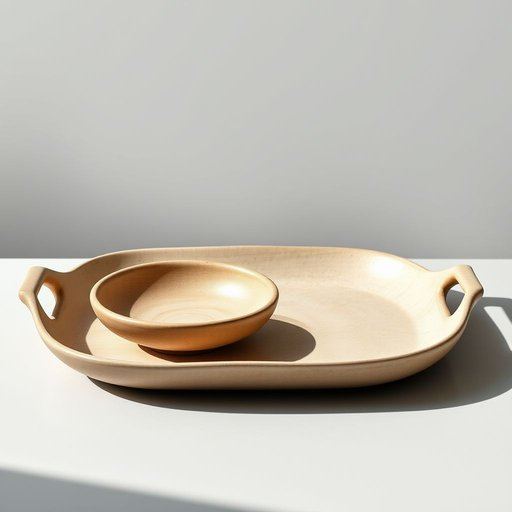

# serveware

<h1 style="font-size: 2.5em; font-weight: 300; letter-spacing: 2px; margin: 0; color: #2c3e50;">
/serveware*/
</h1>

---

---

## 例句

Could you please help me unpack the serveware from the boxes in the kitchen, especially the platters and serving bowls that are both elegant enough for the dinner party we’re hosting tonight and sturdy enough to handle the roast and side dishes without any risk of chipping?

*Could(/kʊd/) you(/ju/) please(/pliz/) help(/hɛlp/) me(/mi/) unpack(/ənˈpæk/) the(/ðə/) serveware(/serveware*/) from(/frəm/) the(/ðə/) boxes(/ˈbɑksɪz/) in(/ɪn/) the(/ðə/) kitchen,(/ˈkɪʧən,/) especially(/əˈspɛʃəli/) the(/ðə/) platters(/ˈplætərz/) and(/ənd/) serving(/ˈsərvɪŋ/) bowls(/boʊlz/) that(/ðət/) are(/ər/) both(/boʊθ/) elegant(/ˈɛləgənt/) enough(/ɪˈnəf/) for(/fər/) the(/ðə/) dinner(/ˈdɪnər/) party(/ˈpɑrti/) we’re(/we’re*/) hosting(/ˈhoʊstɪŋ/) tonight(/təˈnaɪt/) and(/ənd/) sturdy(/ˈstərdi/) enough(/ɪˈnəf/) to(/tɪ/) handle(/ˈhændəl/) the(/ðə/) roast(/roʊst/) and(/ənd/) side(/saɪd/) dishes(/ˈdɪʃɪz/) without(/wɪˈθaʊt/) any(/ˈɛni/) risk(/rɪsk/) of(/əv/) chipping?(/ˈʧɪpɪŋ?/)*

**翻译：** 您能帮我把厨房里的餐具从箱子里拿出来吗？特别是那些既优雅适合我们今晚举办的晚宴，又足够坚固能够盛放烤肉和配菜而不易破损的大盘子和盛菜碗。

---

## 解释

英语单词'serveware'作为名词主要指用于上菜和盛放食物的餐具用品，如盘子、碗、托盘、勺子、刀叉等，通常在家庭聚餐、宴会、餐厅服务等场合中使用，强调的是专门为食物布置和分发设计的器皿。学习者在使用该词时需注意，它是一个不可数名词，通常不加复数形式，被当作整体或类别使用，如“a set of serveware”表示“一套餐具”；常见搭配有“table serveware”、“ceramic serveware”等，表达时多与材质、用途或场景连用。词源方面，‘serveware’由动词‘serve’（服务、上菜）和名词后缀‘ware’（器具）组合而成，本意即“上菜用的器具”，起源于厨房和餐饮服务领域的专业用语。将其准确翻译为中文时，最恰当的表达通常是“餐具”、“上菜用具”或“盛放食物用具”，强调其功能性而非单纯餐具的所有种类，也区别于“餐具”中包括日常使用的刀叉筷子等。该词本身无特殊的褒贬意义或文化色彩，属于中性词汇，适合正式和非正式语境，但在中文语境中使用时，应根据具体场合选择“餐具”还是更具功能描述的“上菜用具”，以避免概念混淆。

---

<small style="color: #999; font-size: 0.9em;">2025-07-17 06:22:40</small>

