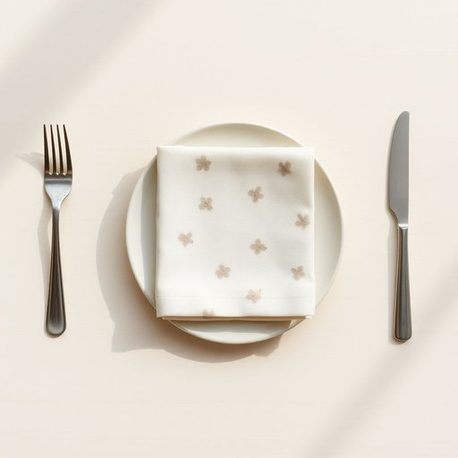

# serviette

<h1 style="font-size: 2.5em; font-weight: 300; letter-spacing: 2px; margin: 0; color: #2c3e50;">
/serviette*/
</h1>

---

---

## 例句

Could you please pass me the serviette that’s folded neatly next to the cutlery on the dining table, the one with the subtle floral pattern that Mum bought last week, so I can wipe my hands before we start eating?

*Could(/kʊd/) you(/ju/) please(/pliz/) pass(/pæs/) me(/mi/) the(/ðə/) serviette(/serviette*/) that’s(/that’s*/) folded(/ˈfoʊldɪd/) neatly(/ˈnitli/) next(/nɛkst/) to(/tɪ/) the(/ðə/) cutlery(/ˈkətləri/) on(/ɔn/) the(/ðə/) dining(/ˈdaɪnɪŋ/) table,(/ˈteɪbəl,/) the(/ðə/) one(/wən/) with(/wɪθ/) the(/ðə/) subtle(/ˈsətəl/) floral(/ˈflɔrəl/) pattern(/ˈpætərn/) that(/ðət/) Mum(/məm/) bought(/bɔt/) last(/læst/) week,(/wik,/) so(/soʊ/) I(/aɪ/) can(/kən/) wipe(/waɪp/) my(/maɪ/) hands(/hænz/) before(/ˌbiˈfɔr/) we(/wi/) start(/stɑrt/) eating?(/ˈitɪŋ?/)*

**翻译：** 请把餐桌上餐具旁边那块叠得整齐、带有淡雅花纹的餐巾递给我，就是妈妈上周买的那块，好让我在开动前擦擦手。

---

## 解释

“serviette”作为名词，主要指餐巾或纸巾，常用于正式或非正式的用餐场合，用来擦拭嘴巴和手部，尤其是在家庭用餐或餐厅环境中很常见。在英语学习中，使用“serviette”时需注意它通常为可数名词，复数形式为“serviettes”，并且多用于英式英语中，北美英语更常用“napkin”一词。此外，常见搭配有“paper serviette”（纸餐巾）、“cloth serviette”（布餐巾）等，用于区分材质。该词源自法语“serviette”，意为“小毛巾”或“擦手巾”，最初引入英语时保持了这一含义，但在现代英语中专指餐桌用品。在中文语境中，“serviette”准确翻译为“餐巾”或“餐巾纸”，强调其在饮食过程中用来擦拭的功能。需要注意的是，尽管“serviette”在英国及部分英联邦国家中普遍接受，但在美国英语中使用较少，偶尔会被误解或显得用词较为正式或古典，并无明显褒贬色彩，但了解地区差异对于语言应用准确性十分重要。

---

<small style="color: #999; font-size: 0.9em;">2025-07-17 06:22:40</small>

