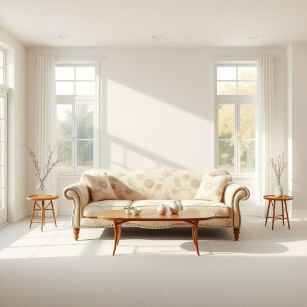

# settee

<h1 style="font-size: 2.5em; font-weight: 300; letter-spacing: 2px; margin: 0; color: #2c3e50;">
/settee*/
</h1>

---

---

## 例句

After rearranging the living room to create more space for the upcoming dinner party, I noticed that the antique settee, which had been passed down through generations and upholstered with a delicate floral fabric, still offered the most comfortable seating despite its seemingly fragile appearance.

*After(/ˈæftər/) rearranging(/ˌriərˈeɪnʤɪŋ/) the(/ðə/) living(/ˈlɪvɪŋ/) room(/rum/) to(/tɪ/) create(/kriˈeɪt/) more(/mɔr/) space(/speɪs/) for(/fər/) the(/ðə/) upcoming(/ˈəpˌkəmɪŋ/) dinner(/ˈdɪnər/) party,(/ˈpɑrti,/) I(/aɪ/) noticed(/ˈnoʊtɪst/) that(/ðət/) the(/ðə/) antique(/ænˈtik/) settee,(/settee*,/) which(/wɪʧ/) had(/hæd/) been(/bɪn/) passed(/pæst/) down(/daʊn/) through(/θru/) generations(/ˌʤɛnərˈeɪʃənz/) and(/ənd/) upholstered(/əˈpoʊlstərd/) with(/wɪθ/) a(/ə/) delicate(/ˈdɛləkət/) floral(/ˈflɔrəl/) fabric,(/ˈfæbrɪk,/) still(/stɪl/) offered(/ˈɔfərd/) the(/ðə/) most(/moʊst/) comfortable(/ˈkəmfərtəbəl/) seating(/ˈsitɪŋ/) despite(/dɪˈspaɪt/) its(/ɪts/) seemingly(/ˈsimɪŋli/) fragile(/ˈfræʤəl/) appearance.(/əˈpɪrəns./)*

**翻译：** 重新布置客厅以腾出更多空间为即将到来的晚宴做准备时，我注意到那张祖传的古董长沙发，虽然外观看似娇嫩，却依然以细腻的花卉布艺包覆，提供了最为舒适的座椅体验。

---

## 解释

“settee”作为名词，主要指的是一种带靠背、两侧有扶手的长椅，通常用于家庭客厅或休息区，是供多人坐的家具，类似于“小沙发”或“长沙发椅”。具体使用场合多见于描述家居环境时，比如谈论家具布置或某处座位安排时使用。在英语学习中，“settee”通常是可数名词，常见搭配包括“a settee in the living room”（客厅里的长沙发）、“an antique settee”（古董长沙发）等，搭配时需要注意定冠词或不定冠词的使用，且它通常替代或与“sofa”或“couch”互换，但较为正式或带有复古风格。“settee”源自法语“settee”，而其更深的词源可追溯到意大利语“seduta”，意为“座位”，体现了欧洲家具设计传入英语的发展背景。在中文语境中，“settee”应准确理解为“长沙发”或“长椅”，区别于单人椅或普通凳子，体现其作为多座沙发的特征。需要注意的是，该词在现代美式英语中使用较少，更多见于英式英语或文学、古董家具描述，带有一定的雅致或复古色彩，没有褒贬意义，属于中性词汇，反映了家居生活中的一种传统家具形态。

---

<small style="color: #999; font-size: 0.9em;">2025-07-17 06:22:40</small>

