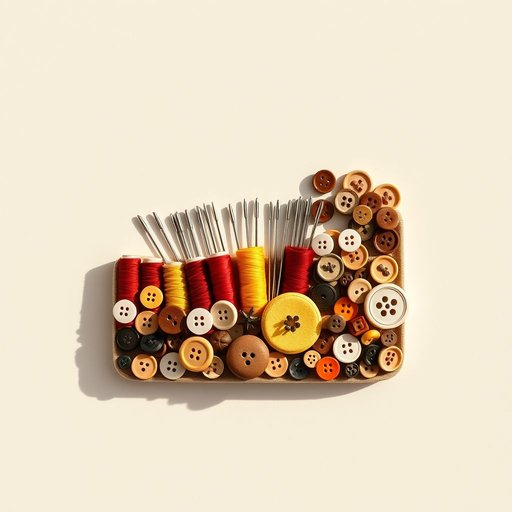

# sewing-kit

<h1 style="font-size: 2.5em; font-weight: 300; letter-spacing: 2px; margin: 0; color: #2c3e50;">
/sewing-kit*/
</h1>

---

---

## 例句

Before we leave for the weekend, could you please check if the sewing-kit in the hall cupboard— the one with all the different coloured threads, needles, and buttons—still has enough supplies, since I’d like to mend the loose hem on my favourite dress as soon as we get back?

*Before(/ˌbiˈfɔr/) we(/wi/) leave(/liv/) for(/fər/) the(/ðə/) weekend,(/ˈwiˌkɪnd,/) could(/kʊd/) you(/ju/) please(/pliz/) check(/ʧɛk/) if(/ɪf/) the(/ðə/) sewing-kit(/sewing-kit*/) in(/ɪn/) the(/ðə/) hall(/hɔl/) cupboard—(/cupboard—*—/) the(/ðə/) one(/wən/) with(/wɪθ/) all(/ɔl/) the(/ðə/) different(/ˈdɪfərənt/) coloured(/ˈkələrd/) threads,(/θrɛdz,/) needles,(/ˈnidəlz,/) and(/ənd/) buttons—still(/buttons—still*/) has(/həz/) enough(/ɪˈnəf/) supplies,(/səˈplaɪz,/) since(/sɪns/) I’d(/i’d*/) like(/laɪk/) to(/tɪ/) mend(/mɛnd/) the(/ðə/) loose(/lus/) hem(/hɛm/) on(/ɔn/) my(/maɪ/) favourite(/ˈfeɪvərɪt/) dress(/drɛs/) as(/ɛz/) soon(/sun/) as(/ɛz/) we(/wi/) get(/gɪt/) back?(/bæk?/)*

**翻译：** 在我们周末出发之前，能否请你检查一下大厅橱柜里的缝纫包——就是那个装有各种颜色线、针和纽扣的缝纫包——是否还有足够的物资？因为我想一回家就修补我那条最喜欢的裙子上松脱的裙边。

---

## 解释

英语单词"sewing-kit"作为名词，指的是一套便携的缝纫工具和用品，通常包括针、线、剪刀、小别针、钮扣等，用于修补或缝制衣物，常见于家居生活用品场景中。具体使用场合多是在家中、旅行途中或紧急情况下，当需要快速修复衣物破损或更换扣子时使用。语境上，"sewing-kit"常用于表达准备缝纫工具的完整套装，例如"The hotel provides a sewing-kit in the room"（酒店房间里提供缝纫包）。英语学习者使用该词时需注意其固定式复合名词结构，通常单数形式使用，且前后多以定冠词或物主代词搭配，比如"a sewing-kit"、"my sewing-kit"。另常见搭配还有"portable sewing-kit"（便携缝纫包）、"basic sewing-kit"（基本缝纫工具）。在表达技巧上，sewing-kit常与动词“use”或“have”搭配使用，如“use a sewing-kit to fix a tear”（用缝纫包修补漏洞）。词源方面，"sewing"源自古英语“sēowian”，意为缝合，“kit”意为一组工具或装备，组合起来指一套缝纫工具集合，反映出其实用性和完整性。在中文语境中，"sewing-kit"准确翻译为“缝纫包”或“缝纫工具包”，强调其便携和功能性，便于理解为日常生活中用于缝补衣物的小型工具合集。该词无特殊褒贬色彩或文化内涵，属于中性且实用的生活用语，体现了生活中对于衣物维护的基本需求。

---

<small style="color: #999; font-size: 0.9em;">2025-07-17 06:22:40</small>

