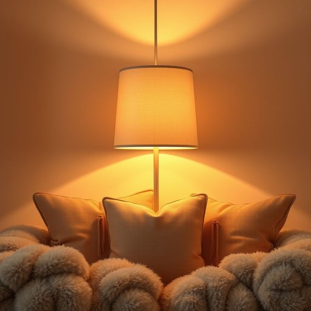

# shade

<h1 style="font-size: 2.5em; font-weight: 300; letter-spacing: 2px; margin: 0; color: #2c3e50;">
/ʃeɪd/
</h1>

---

---

## 例句

Could you please adjust the shade on the living room lamp before the guests arrive, as its current brightness is a bit too harsh for the cosy atmosphere we’re aiming to create with the soft cushions and warm-toned décor?

*Could(/kʊd/) you(/ju/) please(/pliz/) adjust(/əˈʤəst/) the(/ðə/) shade(/ʃeɪd/) on(/ɔn/) the(/ðə/) living(/ˈlɪvɪŋ/) room(/rum/) lamp(/læmp/) before(/ˌbiˈfɔr/) the(/ðə/) guests(/gɛsts/) arrive,(/əraɪv,/) as(/ɛz/) its(/ɪts/) current(/ˈkɑrənt/) brightness(/ˈbraɪtnəs/) is(/ɪz/) a(/ə/) bit(/bɪt/) too(/tu/) harsh(/hɑrʃ/) for(/fər/) the(/ðə/) cosy(/ˈkoʊzi/) atmosphere(/ˈætməsˌfɪr/) we’re(/we’re*/) aiming(/ˈeɪmɪŋ/) to(/tɪ/) create(/kriˈeɪt/) with(/wɪθ/) the(/ðə/) soft(/sɔft/) cushions(/ˈkʊʃənz/) and(/ənd/) warm-toned(/warm-toned*/) décor?(/décor*?/)*

**翻译：** 请您在客人到来前调整一下客厅台灯的灯罩，因为目前的亮度有些刺眼，不太符合我们希望通过柔软靠垫和温暖色调装饰营造的舒适氛围。

---

## 解释

英语单词“shade”在家居生活用品场景中作为名词，主要指遮光物，尤其是灯罩或窗帘用来挡住或调节光线的部分，常见于台灯、吊灯或窗户上，用以减少直射光带来的刺眼感并营造柔和的光线环境。具体使用场合多见于室内装饰、照明设计以及家具描述，例如“lamp shade”（灯罩）或“window shade”（窗帘）。英语学习者在使用“shade”时需注意其单复数形式“shades”，且常与“lamp”、“window”等名词搭配形成固定短语，表达时通常为“a shade of lamp”或“pull down the shade”等。此外，“shade”还可引申为颜色的深浅层次，此处需结合上下文区分。词源上，“shade”源自古英语“sceadu”，意指遮蔽或阴影，反映其本质为遮挡光线的物品。在中文语境中，译为“灯罩”或“遮光罩”时尤为准确，强调物理遮蔽功能；译为“遮阳帘”或“窗帘”时则侧重于调节自然光线，对环境氛围有实用和美学双重作用。“shade”在家居用品语境中通常无褒贬色彩，但因其涉及光线调节，有时隐喻保护或安静的空间感，具有积极的文化内涵。总之，理解“shade”作为家居名词时，应聚焦其功能性和环境营造作用，避免与色彩表达混淆。

---

<small style="color: #999; font-size: 0.9em;">2025-07-17 06:22:40</small>

