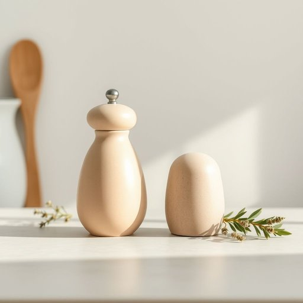

# shaker

<h1 style="font-size: 2.5em; font-weight: 300; letter-spacing: 2px; margin: 0; color: #2c3e50;">
/ˈʃeɪkər/
</h1>

---

---

## 例句

Could you please pass me the salt shaker that’s sitting next to the pepper grinder on the kitchen table, as I need to season the stew properly before it goes into the oven?

*Could(/kʊd/) you(/ju/) please(/pliz/) pass(/pæs/) me(/mi/) the(/ðə/) salt(/sɔlt/) shaker(/ˈʃeɪkər/) that’s(/that’s*/) sitting(/ˈsɪtɪŋ/) next(/nɛkst/) to(/tɪ/) the(/ðə/) pepper(/ˈpɛpər/) grinder(/ˈgraɪndər/) on(/ɔn/) the(/ðə/) kitchen(/ˈkɪʧən/) table,(/ˈteɪbəl,/) as(/ɛz/) I(/aɪ/) need(/nid/) to(/tɪ/) season(/ˈsizən/) the(/ðə/) stew(/stu/) properly(/ˈprɑpərli/) before(/ˌbiˈfɔr/) it(/ɪt/) goes(/goʊz/) into(/ˈɪntu/) the(/ðə/) oven?(/ˈəvən?/)*

**翻译：** Could you please pass me the salt shaker next to the pepper grinder on the kitchen table? I need to season the stew before putting it into the oven.

---

## 解释

英语单词“shaker”在家居生活用品场景中作为名词，通常指用于摇动混合或分散物质的小容器或器具，比如调味瓶（如盐瓶、胡椒瓶）以及调酒用的摇酒器。在具体使用场合上，shaker多见于厨房、餐厅或酒吧环境中，用于调味品的均匀撒布或饮品的混合调制。英语学习者需要注意的是，“shaker”作为可数名词，通常与定冠词the或不定冠词a/an连用，且常见搭配有pepper shaker（胡椒瓶）、salt shaker（盐瓶）、cocktail shaker（调酒壶）等，表达时需依上下文明确指代的物品种类。此外，shaker的词源来自古英语“shake”（摇动），表明其功能核心是通过摇晃使内容物混合或散开。中文语境中，“shaker”通常准确翻译为“摇壶”、“摇酒壶”或“调味瓶”，具体依使用对象而定。该词本身无贬义色彩，属于中性且日常生活常用的名词，文化内涵较为直接，与摇动混合的功能密切相关。

---

<small style="color: #999; font-size: 0.9em;">2025-07-17 06:22:40</small>

