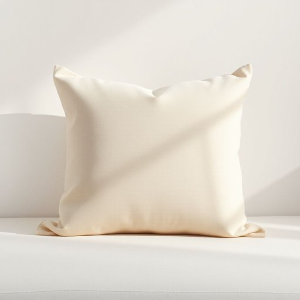

# sham

<h1 style="font-size: 2.5em; font-weight: 300; letter-spacing: 2px; margin: 0; color: #2c3e50;">
/ʃæm/
</h1>

---

---

## 例句

Could you please help me find the sham for the throw pillow in the living room, the one with the intricate floral embroidery that Mum bought last summer, because I want to make sure the cushions look neat and coordinated before our guests arrive tonight?

*Could(/kʊd/) you(/ju/) please(/pliz/) help(/hɛlp/) me(/mi/) find(/faɪnd/) the(/ðə/) sham(/ʃæm/) for(/fər/) the(/ðə/) throw(/θroʊ/) pillow(/ˈpɪloʊ/) in(/ɪn/) the(/ðə/) living(/ˈlɪvɪŋ/) room,(/rum,/) the(/ðə/) one(/wən/) with(/wɪθ/) the(/ðə/) intricate(/ˈɪntrəkət/) floral(/ˈflɔrəl/) embroidery(/ɛmˈbrɔɪdəri/) that(/ðət/) Mum(/məm/) bought(/bɔt/) last(/læst/) summer,(/ˈsəmər,/) because(/bɪˈkəz/) I(/aɪ/) want(/wɔnt/) to(/tɪ/) make(/meɪk/) sure(/ʃʊr/) the(/ðə/) cushions(/ˈkʊʃənz/) look(/lʊk/) neat(/nit/) and(/ənd/) coordinated(/koʊˈɔrdəneɪtɪd/) before(/ˌbiˈfɔr/) our(/ɑr/) guests(/gɛsts/) arrive(/əraɪv/) tonight?(/təˈnaɪt?/)*

**翻译：** 你能帮我找到客厅里那个抱枕的枕套吗？就是妈妈去年夏天买的那个带有精致花卉刺绣的枕套，因为我想确保在今晚客人来之前，靠垫看起来整齐协调。

---

## 解释

在家居生活用品的语境中，英语单词“sham”作为名词通常指的是一种装饰性枕套，主要用来覆盖枕头，使其外观整洁美观，常见于卧室布置中。这种“sham”一般在床品套件中出现，用于保护枕芯同时提升整体床上用品的装饰效果，使用场合多为家庭卧室或酒店客房。英语学习者需注意，“sham”作为名词时多与“pillow sham”搭配，即“枕头套”，且其复数形式为“shams”，在句中常用作可数名词。此外，“sham”还可用作形容词和动词，含义为“假的、伪装的”，但在家居用品领域主要指枕套，语义比较中性。词源方面，“sham”最初源于19世纪中期，意为“假货、伪装品”，后来在家居领域专指装饰用的枕套，这可能与其遮盖实物表面的功能相呼应。在中文语境中，准确翻译“sham”为“装饰枕套”或“枕套罩”，强调其装饰性和实用性，而非一般枕套；需要避免与“假冒、虚假”的“sham”混淆。总之，在家居用品环境下，“sham”是中性、具体指一种枕头用装饰罩的名词，英语学习者需根据语境辨别其功能性含义与比喻性贬义，确保正确使用。

---

<small style="color: #999; font-size: 0.9em;">2025-07-17 06:22:40</small>

