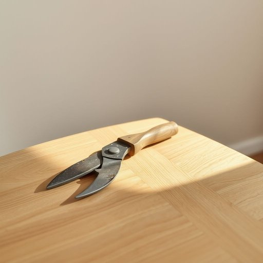

# shears

<h1 style="font-size: 2.5em; font-weight: 300; letter-spacing: 2px; margin: 0; color: #2c3e50;">
/ʃirz/
</h1>

---

---

## 例句

I forgot my keys on the table where we always leave them after coming home from work, so can you please check if they’re still there before we head out to the party downtown later this evening?

*I(/aɪ/) forgot(/fərˈgɑt/) my(/maɪ/) keys(/kiz/) on(/ɔn/) the(/ðə/) table(/ˈteɪbəl/) where(/wɛr/) we(/wi/) always(/ˈɔlˌweɪz/) leave(/liv/) them(/ðɛm/) after(/ˈæftər/) coming(/ˈkəmɪŋ/) home(/hoʊm/) from(/frəm/) work,(/wərk,/) so(/soʊ/) can(/kən/) you(/ju/) please(/pliz/) check(/ʧɛk/) if(/ɪf/) they’re(/they’re*/) still(/stɪl/) there(/ðɛr/) before(/ˌbiˈfɔr/) we(/wi/) head(/hɛd/) out(/aʊt/) to(/tɪ/) the(/ðə/) party(/ˈpɑrti/) downtown(/ˈdaʊnˈtaʊn/) later(/ˈleɪtər/) this(/ðɪs/) evening?(/ˈivnɪŋ?/)*

**翻译：** 我把钥匙忘在了我们每天下班回来后总放的桌子上，能麻烦你先帮我看看钥匙还在那里吗？我们等会儿去市区的派对前顺便确认一下。

---

## 解释

英语单词 "shears" 在家居生活用品的语境中作为名词，通常指一种大型剪刀或剪切工具，常用于修剪植物、裁剪布料或其他较厚材料。具体使用场合多见于园艺如修剪灌木、家务活如剪裁布料纸张及缝纫工作中。学习者需要注意的是，"shears" 一般为复数形式使用，且通常没有单数形式 "shear" 用作剪刀，这点不同于普通剪刀 "scissors"。在语法搭配上，常见表达有 "a pair of shears"（一把剪刀）、“garden shears”（园艺剪）、"use the shears to trim"（用剪刀修剪）等，表达时需搭配适当的量词 "pair" 来强调其双刃结构，此外它属于可数名词复数形式但整体指一把工具。词源上，"shears" 源自古英语 "scēara" 或 "scēoran"，意为“切割”，与现代英语 "shear"（剪切）有关，反映了其作为剪切工具的本质。中文中 "shears" 准确翻译为“剪刀”或“（园艺）剪”，在家居生活环境下指较大、较重的剪刀，而非一般的办公或日常小剪刀。该词本身无明显褒贬色彩，也无特殊文化含义，属于中性词，用于描述具体工具，理解时应结合具体情境区分 "scissors" 与 "shears" 的大小和用途差异。

---

<small style="color: #999; font-size: 0.9em;">2025-07-17 06:22:40</small>

