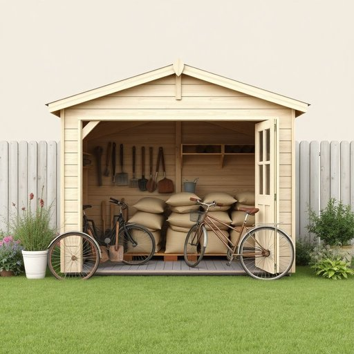

# shed

<h1 style="font-size: 2.5em; font-weight: 300; letter-spacing: 2px; margin: 0; color: #2c3e50;">
/ʃɛd/
</h1>

---

---

## 例句

After spending all morning sorting out the clutter in the garden, I finally managed to organise the shed, which, despite its small size, stores everything from rusty gardening tools and bags of compost to the old bicycles that the kids have outgrown but refuse to throw away.

*After(/ˈæftər/) spending(/ˈspɛndɪŋ/) all(/ɔl/) morning(/ˈmɔrnɪŋ/) sorting(/ˈsɔrtɪŋ/) out(/aʊt/) the(/ðə/) clutter(/ˈklətər/) in(/ɪn/) the(/ðə/) garden,(/ˈgɑrdən,/) I(/aɪ/) finally(/ˈfaɪnəli/) managed(/ˈmænɪʤd/) to(/tɪ/) organise(/organise*/) the(/ðə/) shed,(/ʃɛd,/) which,(/wɪʧ,/) despite(/dɪˈspaɪt/) its(/ɪts/) small(/smɔl/) size,(/saɪz,/) stores(/stɔrz/) everything(/ˈɛvriˌθɪŋ/) from(/frəm/) rusty(/ˈrəsti/) gardening(/ˈgɑrdənɪŋ/) tools(/tulz/) and(/ənd/) bags(/bægz/) of(/əv/) compost(/ˈkɑmpoʊst/) to(/tɪ/) the(/ðə/) old(/oʊld/) bicycles(/ˈbaɪsɪkəlz/) that(/ðət/) the(/ðə/) kids(/kɪdz/) have(/hæv/) outgrown(/ˌaʊtˈgroʊn/) but(/bət/) refuse(/ˈrɛfˌjuz/) to(/tɪ/) throw(/θroʊ/) away.(/əˈweɪ./)*

**翻译：** 花了整个上午整理花园里的杂物后，我终于把那个小巧的工具棚收拾整齐了。尽管空间不大，里面却堆放着各种物品，从生锈的园艺工具和堆肥袋，到孩子们已经不再适用但又舍不得丢弃的旧自行车，应有尽有。

---

## 解释

英语单词shed作为名词在家居生活用品的语境中，通常指一种小型的简易建筑物或棚子，主要用来存放园艺工具、户外设备、自行车或其他杂物，常见于家庭庭院或花园中。具体使用场合多为描述居家环境中的附属存储空间，例如garden shed（花园工具棚）或tool shed（工具棚）。学习者使用该词时需注意，shed作为名词是可数名词，复数形式为sheds；其常见搭配包括garden shed、tool shed、storage shed等，表达时一般会在前面加上与用途相关的名词来明确功能。在词源方面，shed源自古英语scead，意为遮蔽之处，最初指简单的遮蔽物，逐渐演变为指储物的小棚子，这一演变反映了该词最初强调保护和遮蔽功能的特点。在中文语境中，shed一般准确翻译为“棚子”、“小屋”或“简易仓库”，语义较为中性，没有明显褒贬色彩，但因其结构简陋，常带有实用性和临时搭建的意味，体现出一种朴素、功能性的文化特点。综上，shed作为名词在家居生活中是指专用于存放杂物的小型建筑物，使用时需结合具体功能词汇，并理解其历史起源和文化内涵，确保翻译和使用的准确性。

---

<small style="color: #999; font-size: 0.9em;">2025-07-17 06:22:40</small>

