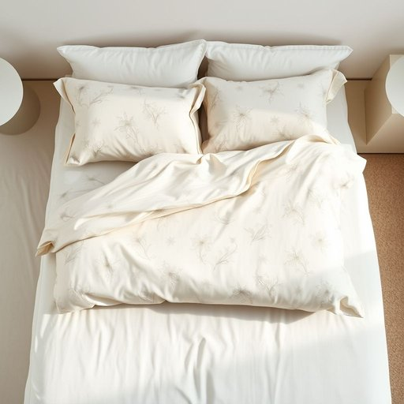

# sheet

<h1 style="font-size: 2.5em; font-weight: 300; letter-spacing: 2px; margin: 0; color: #2c3e50;">
/ʃit/
</h1>

---

---

## 例句

Could you please check if the clean sheet I folded this morning, which has that faint floral pattern we both like, is the one meant for the guest room bed, or did I accidentally mix it up with the sheets from our own bedroom?

*Could(/kʊd/) you(/ju/) please(/pliz/) check(/ʧɛk/) if(/ɪf/) the(/ðə/) clean(/klin/) sheet(/ʃit/) I(/aɪ/) folded(/ˈfoʊldɪd/) this(/ðɪs/) morning,(/ˈmɔrnɪŋ,/) which(/wɪʧ/) has(/həz/) that(/ðət/) faint(/feɪnt/) floral(/ˈflɔrəl/) pattern(/ˈpætərn/) we(/wi/) both(/boʊθ/) like,(/laɪk,/) is(/ɪz/) the(/ðə/) one(/wən/) meant(/mɛnt/) for(/fər/) the(/ðə/) guest(/gɛst/) room(/rum/) bed,(/bɛd,/) or(/ər/) did(/dɪd/) I(/aɪ/) accidentally(/ˌæksəˈdɛnəli/) mix(/mɪks/) it(/ɪt/) up(/əp/) with(/wɪθ/) the(/ðə/) sheets(/ʃits/) from(/frəm/) our(/ɑr/) own(/oʊn/) bedroom?(/ˈbɛˌdrum?/)*

**翻译：** 你能帮我确认一下我今天早上叠的那条干净床单吗？就是带有我们都喜欢的淡淡花卉图案的那条，是不是用在客房的床上？还是我不小心把它和我们自己卧室的床单弄混了？

---

## 解释

英语单词’sheet’作为名词在家居生活用品的语境中，通常指床单，即覆盖在床垫或被褥上的布料，用于保护床垛和增加舒适度。具体使用场合包括铺在床上、与枕套、被套搭配使用，常见于家庭卧室、酒店客房等场景中。学习者需要注意’sheet’通常是可数名词，用复数形式’sheets’表示多张床单；搭配上常见表达有“bed sheet”（床单）、“fitted sheet”（带松紧带的床单）、“flat sheet”（平铺床单），此外还常见用法如“change the sheets”（换床单）或“sheet set”（床单套装）。语法上，’sheet’作为单数名词时，谓语动词须使用单数形式，且在具体指某张床单时通常用定冠词the。词源上，’sheet’源自古英语’sceat’，意指一片织物，后来泛指布料片，广义上也可指一张平铺的材料，演变至今专指床上的布单。中文语境中，’sheet’应准确译为“床单”，避免与“纸张”或“薄片”等其他含义混淆。此词无明显褒贬色彩，属日常生活中常用且中性词汇，体现生活的舒适和整洁习惯。整体来看，’sheet’在家居用品领域是指床上用的大块布料，使用频繁，表达简洁明确，掌握其常见搭配及语法形式有助于提升英语表达的地道性。

---

<small style="color: #999; font-size: 0.9em;">2025-07-17 06:22:40</small>

