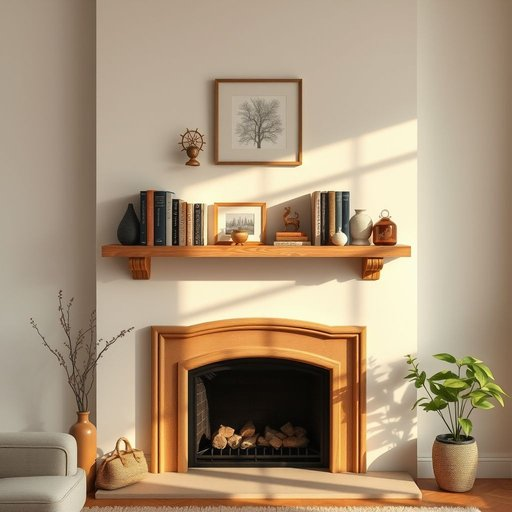

# shelf

<h1 style="font-size: 2.5em; font-weight: 300; letter-spacing: 2px; margin: 0; color: #2c3e50;">
/ʃɛlf/
</h1>

---

---

## 例句

Could you please help me tidy up the living room by arranging the books and ornaments neatly on the wooden shelf that Dad built last summer, which is situated just above the fireplace and catches the morning sunlight perfectly?

*Could(/kʊd/) you(/ju/) please(/pliz/) help(/hɛlp/) me(/mi/) tidy(/ˈtaɪdi/) up(/əp/) the(/ðə/) living(/ˈlɪvɪŋ/) room(/rum/) by(/baɪ/) arranging(/ərˈeɪnʤɪŋ/) the(/ðə/) books(/bʊks/) and(/ənd/) ornaments(/ˈɔrnəmənts/) neatly(/ˈnitli/) on(/ɔn/) the(/ðə/) wooden(/ˈwʊdən/) shelf(/ʃɛlf/) that(/ðət/) Dad(/dæd/) built(/bɪlt/) last(/læst/) summer,(/ˈsəmər,/) which(/wɪʧ/) is(/ɪz/) situated(/ˈsɪʧuˌeɪtɪd/) just(/ʤɪst/) above(/əˈbəv/) the(/ðə/) fireplace(/ˈfaɪərˌpleɪs/) and(/ənd/) catches(/ˈkæʧɪz/) the(/ðə/) morning(/ˈmɔrnɪŋ/) sunlight(/ˈsənˌlaɪt/) perfectly?(/ˈpərfəktli?/)*

**翻译：** 您能帮我整理一下客厅吗？请把那些书籍和装饰品整齐地摆放在爸爸去年夏天亲手做的木质书架上，那书架就位于壁炉正上方，清晨的阳光正好洒落其上。

---

## 解释

英语单词shelf在家居生活用品的语境中作为名词，通常指用于放置物品的平面结构，如墙上的置物架、书架上的层板或橱柜内的托盘，具体使用场合包括家庭客厅的书架、厨房的调料架或浴室的洗漱用品架，语境多围绕物品的存放和展示，英语学习者需要注意shelf的复数形式为shelves，这属于不规则复数变化，且常见短语搭配有“on the shelf”（在架子上）、“a bookshelf”（书架）、“to put something on a shelf”（把某物放到架子上）等，此外，“shelf life”也是一个常用表达，意指商品保质期，词源方面，shelf源自古英语scylfe，意指陡峭的山脊或岩架，后来引申为类似的平坦且突出的结构，用以承载物品，中文语境中，shelf通常译为“架子”或“搁板”，强调其承重和放置功能，绝大多数情况下不含褒贬义，属于中性名词，但在特定语境中如“to be put on the shelf”也可比喻某人被搁置不用，有轻微的消极隐含，整体来说，shelf在家居生活中是一种常见且实用的名词，理解其物理属性及常用搭配对英语学习者的词汇应用非常重要。

---

<small style="color: #999; font-size: 0.9em;">2025-07-17 06:22:40</small>

