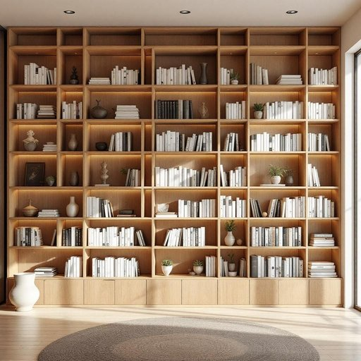

# shelving

<h1 style="font-size: 2.5em; font-weight: 300; letter-spacing: 2px; margin: 0; color: #2c3e50;">
/ˈʃɛlvɪŋ/
</h1>

---

---

## 例句

The intricate shelving, designed with precision to maximize storage efficiency while maintaining an aesthetic appeal, serves as the centerpiece of the modern library, accommodating both rare manuscripts and contemporary novels with equal grace.

*The(/ðə/) intricate(/ˈɪntrəkət/) shelving,(/ˈʃɛlvɪŋ,/) designed(/dɪˈzaɪnd/) with(/wɪθ/) precision(/priˈsɪʒən/) to(/tɪ/) maximize(/ˈmæksəˌmaɪz/) storage(/ˈstɔrɪʤ/) efficiency(/ɪˈfɪʃənsi/) while(/waɪl/) maintaining(/meɪnˈteɪnɪŋ/) an(/ən/) aesthetic(/ɛsˈθɛtɪk/) appeal,(/əˈpil,/) serves(/sərvz/) as(/ɛz/) the(/ðə/) centerpiece(/ˈsɛntərˌpis/) of(/əv/) the(/ðə/) modern(/ˈmɑdərn/) library,(/ˈlaɪbrɛˌri,/) accommodating(/əˈkɑməˌdeɪtɪŋ/) both(/boʊθ/) rare(/rɛr/) manuscripts(/ˈmænjəˌskrɪpts/) and(/ənd/) contemporary(/kənˈtɛmpərˌɛri/) novels(/ˈnɑvəlz/) with(/wɪθ/) equal(/ˈikwəl/) grace.(/greɪs./)*

**翻译：** 这款精心设计的复杂书架，既最大化了储物效率，又保持了美学魅力，成为现代图书馆的核心，不论是珍贵的手稿还是当代小说，都能优雅地容纳其中。

---

## 解释

“shelving”作为名词在家居生活用品的语境中，通常指的是“架子”或“搁板”，即用于存放或展示物品的平面结构，常见于书架、壁架、储藏室等场所。具体使用场合多为描述家具的组成部分或家居收纳方案，如“wooden shelving”（木制架子）或“metal shelving unit”（金属搁板单元）。英语学习者需要注意的是，作为不可数名词时，“shelving”指架子的整体系统或材质，不同于可数名词“shelf”（单个的架板）；此外，通常搭配形容词（如adjustable shelving，可调节搁板）或具体材料词汇出现。语法上，“shelving”一词本质为动名词形式，但在该语境用作名词时无需附加复数形式。词源上，“shelving”来源于动词“shelve”加-ing形式，源自中古英语“shelve”，意指“放在架子上”或“搁置”，进一步可追溯至古英语“scelf”意指“架子”或“板状突出物”，反映其用于支撑和存储物品的功能。在中文语境下，准确翻译为“架子”、“搁板”或“置物架”，强调其结构性和功能性，而非单个的盘子或托盘。该词在家居领域中为中性词，无褒贬色彩或特殊文化内涵，主要用于指称实用的储物设施，理解时应避免将其混淆为动词或其他非家居相关含义。

---

<small style="color: #999; font-size: 0.9em;">2025-07-17 06:22:40</small>

